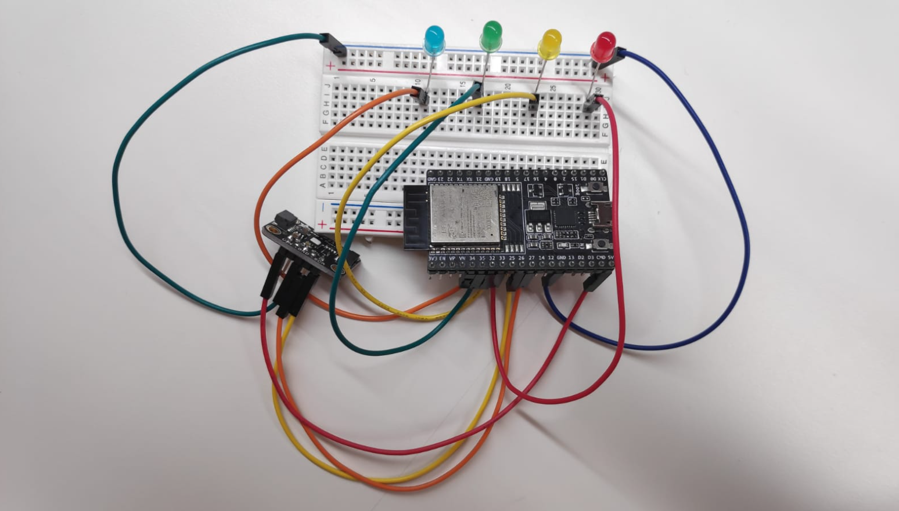

# Aplicación Consola

## Cuestión 1

>Cuestión
>
>¿Qué componente se está incluyendo además de los que siempre se incluyen por defecto?

Los componentes son aquellas unidades básicas que componentes los proyectos de **Espressif**, y estos deben contener todos un fichero **CMakeList.txt**. Cuando creamos un proyecto desde cero, el mismo ya contiene su propio fichero **CMakeList.txt**, el cual es utilizado apra establecer alguans configuraciones relacionadas con al compilación y ejecución.

Si analizamos el fichero **CMakelists.txt** que esta contenido en el directorio raíz del ejemplo **basic**, podremos ver el siguiente contenido:

```C
cmake_minimum_required(VERSION 3.16)

set(EXTRA_COMPONENT_DIRS $ENV{IDF_PATH}/examples/system/console/advanced/components)

include($ENV{IDF_PATH}/tools/cmake/project.cmake)
project(console)
```

En la segunda línea del fichero se está introduciendo una dirección local donde se encuentran unos componentes a importar. Debemos de tener en cuenta que la dirección de los componetes que debe importar el proyecto viene dada por dos variables:
 - **COMPONENT_DIRS:** Variable que referencia los directorios en los cuales el proyecto buscará los compoenntes predeterminados.
 - **EXTRA_COMPONENT_DIRS:** Variable en la cual podremos incluir directorios adicionales donde el proyecto debe buscar componentes a la hora de compilar el proyecto.

Si en el caso de observar la dirección especificada, podremos ver el siguiente resultado:

```BASH
debian12:~/esp/esp-idf/examples/system/console/advanced/components$ ls -l
total 12
drwxr-xr-x 2 mario mario 4096 sep 18 12:24 cmd_nvs
drwxr-xr-x 2 mario mario 4096 sep 18 12:24 cmd_system
drwxr-xr-x 2 mario mario 4096 sep 18 12:24 cmd_wifi
debian12:~/esp/esp-idf/examples/system/console/advanced/components$ ls cmd_nvs/
CMakeLists.txt  cmd_nvs.c  cmd_nvs.h
debian12:~/esp/esp-idf/examples/system/console/advanced/components$ ls cmd_system/
CMakeLists.txt  cmd_system.c  cmd_system_common.c  cmd_system.h  cmd_system_sleep.c
debian12:~/esp/esp-idf/examples/system/console/advanced/components$ ls cmd_wifi/
CMakeLists.txt  cmd_wifi.c  cmd_wifi.h
```

En el salida observamos como hay tres componentes denominados **cmd_nvs**, **cmd_system** y **cmd_wifi**, cada uno de los cuales contiene su propio fichero **CMakeLists.tst**. Además de esto, podemos ver como en el inicio de la aplciación se encuentran importados dichos componentes:

```C
#include "cmd_system.h"
#include "cmd_wifi.h"
#include "cmd_nvs.h"
```

De este modo podemos llegar a la conclusión de que el proyecto esta importando los tes componentes externos indicados.


## Cuestión 2

>Cuestión
>
>¿Qué funcionalidad se importa de dicho componente?

Todos los componentes contienen funciones para llevar a a cabo la interacción con el intérprete en linea de comandos, sin emabrgo, cada uno de ellos desarrolla una funcionalidad en concreto. Para responder esta pregunta analizaremos los ficheros de cabecera de cada uno de los componentes:

- **cmd_system:** Se trata del principal de los tres componentes importados y nos proporciona soporte para las funciones elementales desarrolladas por el interprete en linea de comandos. El siguiente cuadro contiene las definiciones del fichero de cabecera:

```C
#pragma once

#ifdef __cplusplus
extern "C" {
#endif

// Register all system functions
void register_system(void);

// Register common system functions: "version", "restart", "free", "heap", "tasks"
void register_system_common(void);

// Register deep and light sleep functions
void register_system_sleep(void);

#ifdef __cplusplus
}
#endif
```

 - **cmd_wifi:** Contiene funciones de configruación y pasos básicos para poder iniciar el driver WIFI en modo Estación y conectarse a una red existente. El siguiente cuadro contiene las definiciones del fichero de cabecera:

```C
#pragma once

#ifdef __cplusplus
extern "C" {
#endif

// Register WiFi functions
void register_wifi(void);

#ifdef __cplusplus
}
#endif
```

 - **cmd_nvs:** Nos permite iniciar el registro de memoria no volatil utilizado para operar con el interprete. El siguiente cuadro contiene las definiciones del fichero de cabecera:

```C
#pragma once

#ifdef __cplusplus
extern "C" {
#endif

// Register NVS functions
void register_nvs(void);

#ifdef __cplusplus
}
#endif
```

## Cuestión 3

>Cuestión
>
>¿Qué particiones se crean al volcar el proyecto en nuestro dispositivo?

Cuando ejecutamos el ejemplo **basic** podemos ver como dentro de este se crea un fichero con información sobre las diferentes particiones de memoria que se han generado dentro de nuestra placa **STM32**.

En la siguiente tabla podemos ver el contenido de dicho fichero, donde de especifican un totral de cuatro particiones, entre las cuales podemos diferenciar el registro nvs, mencionado en la cuestión anterior y generado mediante el componente **cmd_nvs**.

```BASH
# Name,   Type, SubType, Offset,  Size, Flags
# Note: if you have increased the bootloader size, make sure to update the offsets to avoid overlap
nvs,      data, nvs,     0x9000,  0x6000,
phy_init, data, phy,     0xf000,  0x1000,
factory,  app,  factory, 0x10000, 1M,
storage,  data, fat,     ,        1M,
```

# Importar código externo como componente (SI7021)
> `Tarea`
>
> El sensor Si7021 incorpora un sensor de tempertarua y de humedad con una interfaz I2C que facilita su uso. En el maletín disponemos de una placa de Adafruit que incorpora dicho sensor. A partir del código disponible en este repositorio de GitHub (https://github.com/jessebraham/esp-si7021), crea un componente llamado si7021 para poder utilizar el sensor sin necesidad de consultar el datasheet.
>
> Copia los ficheros i2c_config.c y i2c_config.h proporcionados en el Campus Virtual en la carpeta main.c de tu proyecto.
> Modifica los ficheros CMakeLists.txt necesarios para la compilación del proyecto.
> Conecta los pines del sensor Si7021
>
> - SDA -> GPIO 26
> - SCL -> GPIO 27
> - GND -> GND
> - VIN -> 5V
>
> En el fichero principal (aquel que contenga la función app_main), incluye una llamada a i2c_master_init(). Posteriormente, utiliza el componente para leer la temperatura.
>
> En las fuentes descargadas, posiblemente tengas que cambiar las referencias a portTICK_RATE_MS por la más reciente portTICK_PERIOD_MS.
>
> IMPORTANTE: recuerda incluir la línea REQUIRES driver en el fichero CMakeLists.txt del componente. Imita el código de la práctica 1 para incluir un bucle infinito que lea la temperatura y la muestre por pantalla cada 2 segundos. Puedes usar la macro I2C_MASTER_NUM como port number en las llamadas a readTemperature().

En el proyecto si7021 se ha creado la carpeta components/si7021 junto a los ficheros [si7021.c](si70121/components/si70121/si7021.c) y [si7021.h](si70121/components/si70121/si7021.h). También se ha creado el fichero [CMakeLists.txt](si70121/components/si70121/CMakeLists.txt) con el siguiente contenido:
```BASH
idf_component_register(SRCS "si7021.c"
                    INCLUDE_DIRS "."
                    REQUIRES "driver")
```

Por otro lado en la carpeta main se han incluido los dos ficheros [i2c_config.c](si70121/main/i2c_config.c) e [i2c_config.h](si70121/main/i2c_config.h) del campus. Además de esto, dentro del fichero [main.c](si70121/main/main.c) se ha definido el tiempo de espera de la tarea **taskShowTemperature** que muestra la temperatura cada 2 segundos y se han realizado las respectivas llamadas a las funciones proporcionadas. En el siguiente cuadro se puede ver el contenido del fichero **main.c**:

```C
#define TIME_WAIT_TASK 2

void taskShowTemperature();

void app_main(void)
{

    i2c_master_init();
    xTaskCreate(&taskShowTemperature, "taskShowTemperatura", 2048, NULL, 5, NULL);
}

void taskShowTemperature()
{

    while (1)
    {
        float temperature = 0;
        readTemperature(I2C_MASTER_NUM, &temperature);

        printf("Temperatura %f\n", temperature);

        vTaskDelay(TIME_WAIT_TASK * 1000 / portTICK_PERIOD_MS);
    }
    vTaskDelete(NULL);
}
```

Una vez se han importado los componenetes necesarios y se han elaborado las llamadas a los misnos, llevamos a cabo el montaje del proyecto. En la siguiente imagen podemos ver el desarrollo de dicho montaje:


Para finalziar realizaremos la ejecución del código con el objetivo de ver el resultado del mismo. En el siguiete cuadro podemos ver la salida y como se logra medir correctamente la temperatura del ambiente.

```BASH
I (326) app_start: Starting scheduler on CPU0
I (331) app_start: Starting scheduler on CPU1
I (331) main_task: Started on CPU0
I (341) main_task: Calling app_main()
I (341) main_task: Returned from app_main()
Temperatura 24.235947
Temperatura 24.235947
Temperatura 24.268122
```

# Encendido de LEDs con GPIO y timer
> `Tarea`
>
> Configura un GPIO como salida y conéctalo a un LED del entrenador del laboratorio. Programa un timer para cambiar el estado del LED cada segundo. Recuerda usar una tierra común.

En este caso, se toma como referencia el proyecto de blink y los ejemplos del campus referentes al timer. Definimos una estructura de tipo `esp_timer_create_args_t` en la que asociamos el callback a la dirección de la función `periodic_timer_callback`.

```C
const esp_timer_create_args_t periodic_timer_args = {
        .callback = &periodic_timer_callback,
        .name = "periodic"};
```

Se crea el timer usando la siguiente instrucción.

```C
esp_timer_create(&periodic_timer_args, &periodic_timer);
```

Seguidamente se inicia con un valor de 1 segundo como periodo.
```C
esp_timer_start_periodic(periodic_timer, 1000000);
```

Definimos del fichero `Kconfig.projbuild` definimos el parámetro `LED_GPIO` para indicar el puerto a configurar como salida, por defecto 14. En el código se define la función `configure_led` donde establecemos el puerto como salida. En los siguientes cuadros podemos ver ambas partes respectivamente:

```C
menu "Example Configuration"

    config LED_GPIO
        int "LED GPIO number"
        default 14
        help
            GPIO number (IOxx) to blink on and off the LED.
            Some GPIOs are used for other purposes (flash connections, etc.) and cannot be used to blink.

endmenu
```

```c
static void configure_led(void)
{
    ESP_LOGI(TAG, "Configure to blink GPIO LED!");
    gpio_reset_pin(BLINK_GPIO);
    /* Set the GPIO as a push/pull output */
    gpio_set_direction(BLINK_GPIO, GPIO_MODE_OUTPUT);
}
```

Se controla el estado del led a través de la variable estática **s_led_state**. Dentro de la función de callback del timer llamamos a la función `blink_led()` y cambiamos su estado.

```c
static void blink_led(void)
{
    /* Set the GPIO level according to the state (LOW or HIGH)*/
    gpio_set_level(BLINK_GPIO, s_led_state);
}

...

ESP_LOGI(TAG, "Cambiando el estado del LED a %s!", s_led_state == true ? "ENCENDIDO" : "APAGADO");
blink_led();

/* Cambiamos el estado del led */
s_led_state = !s_led_state;

```

Como paso previo a la ejecución, necesitaremos llevar a cabo el montaje del proyecto. En la siguiente imagen podemos ver un ejemplo del mismo conforme a los datos especificados en el proyecto.


Por último, realizamos la ejecucicón del código y podemos ver como obtenemos la siguiente salida. Ademmás de este, y conforme al montaje mostrado anteriormente, el led se iliminará a los intervalos regulares marcados por el programa.

```C
I (338) main_task: Calling app_main()
I (338) led: Configure to blink GPIO LED!
I (338) gpio: GPIO[14]| InputEn: 0| OutputEn: 0| OpenDrain: 0| Pullup: 1| Pulldown: 0| Intr:0 
I (348) main_task: Returned from app_main()
I (1348) led: Llamada periodica al timer, tiempo desde el arranque 1054421 us

I (1348) led: Cambiando el estado del LED a APAGADO!
I (2348) led: Llamada periodica al timer, tiempo desde el arranque 2054390 us

I (2348) led: Cambiando el estado del LED a ENCENDIDO!
I (3348) led: Llamada periodica al timer, tiempo desde el arranque 3054390 us
```


# Ejercicio final

> `Tarea`
>
> Incluye el componente si7021 en tu proyecto, junto con los ficheros i2c_config.c y i2c_config.h y conecta la placa del sensor a la placa del ESP32.
>
> Crea una aplicación que:
> - Muestree la temperatura cada segundo utilizando un timer.
> - Muestre el progreso de la temperatura usando 4 LEDs. Si la temperatura es inferior a 20 grados, todos estarán apagados. Se encederá un LED por cada 2 grados de temperatura.
> - Se programará un segundo timer que mostrará por pantalla (puerto serie) la última medida de temperatura realizada cada 10 segundos.

## Timer muestreo
Se crea una estructura en la que se asocia como manejador la función `periodic_timer_callback`.
Se inicia con un periodo de 1 segundo.

```c
    const esp_timer_create_args_t periodic_timer_args = {
        .callback = &periodic_timer_callback,
        .name = "periodic_temp_sample"};
    esp_timer_handle_t periodic_timer;
    esp_timer_create(&periodic_timer_args, &periodic_timer);

    esp_timer_start_periodic(periodic_timer, 1000000);
```

Dentro de la función del timer leemos la temperatura desde el sensor y actualizamos el estado GPIO de los leds.

```c
    // Leemos la temperatura
    readTemperature(I2C_MASTER_NUM, &temperature);
    printf("Timer Muestreo | Temperatura %f\n", temperature);

    // Actualizamos el estado de los leds en función de la temperatura
    leds_state[0] = (temperature >= 20) ? true : false;
    leds_state[1] = (temperature >= 22) ? true : false;
    leds_state[2] = (temperature >= 24) ? true : false;
    leds_state[3] = (temperature >= 26) ? true : false;

    // Actualizamos el estado de GPIO para los leds
    update_leds();
```

## 4 LEDS
Se configuran como entrada en `menuconfig` y se configuran como salida en la función `configure_leds()` que se llama desde `main`. En los siguientes cuadros podemos ver la definición de las variables de configuración y la importación de las mismas junto a su definciión como pin de entrada, respectivamente:

```C
menu "Example Configuration"

    config LED1_GPIO
        int "LED1 GPIO number"
        default 34
        help
            GPIO number (IOxx) to blink on and off the LED1.
            Some GPIOs are used for other purposes (flash connections, etc.) and cannot be used to blink.

    config LED2_GPIO
        int "LED2 GPIO number"
        default 35
        help
            GPIO number (IOxx) to blink on and off the LED2.
            Some GPIOs are used for other purposes (flash connections, etc.) and cannot be used to blink.
    
    config LED3_GPIO
        int "LED3 GPIO number"
        default 32
        help
            GPIO number (IOxx) to blink on and off the LED3.
            Some GPIOs are used for other purposes (flash connections, etc.) and cannot be used to blink.

    config LED4_GPIO
        int "LED4 GPIO number"
        default 33
        help
            GPIO number (IOxx) to blink on and off the LED4.
            Some GPIOs are used for other purposes (flash connections, etc.) and cannot be used to blink.

endmenu
```

```c
#define LED1_GPIO CONFIG_LED1_GPIO
#define LED2_GPIO CONFIG_LED2_GPIO
#define LED3_GPIO CONFIG_LED3_GPIO
#define LED4_GPIO CONFIG_LED4_GPIO

static void configure_leds(void)
{
    ESP_LOGI(TAG, "Configuramos GPIO LEDs!");
    gpio_reset_pin(LED1_GPIO);
    gpio_reset_pin(LED2_GPIO);
    gpio_reset_pin(LED3_GPIO);
    gpio_reset_pin(LED4_GPIO);

    /* Configuramos los puertos GPIO como salida */
    gpio_set_direction(LED1_GPIO, GPIO_MODE_OUTPUT);
    gpio_set_direction(LED2_GPIO, GPIO_MODE_OUTPUT);
    gpio_set_direction(LED3_GPIO, GPIO_MODE_OUTPUT);
    gpio_set_direction(LED4_GPIO, GPIO_MODE_OUTPUT);
}
```

Su estado se actualiza acorde al valor de la temperatura en la función de callback del timer `periodic_temp_sample`.
## Timer puerto serie
Se crea una estructura en la que se asocia como manejador la función `periodic_uart_timer_callback`.

Se inicia con un periodo de 10 segundo.
```c
    const esp_timer_create_args_t periodic_uart_timer_args = {
        .callback = &periodic_uart_timer_callback,
        .name = "periodic_temp_uart"};
    esp_timer_handle_t periodic_timer_uart;
    esp_timer_create(&periodic_uart_timer_args, &periodic_timer_uart);

    esp_timer_start_periodic(periodic_timer_uart, 10000000);
```

Dentro de la función de callback se muestra la última temperatura leida por el timer de muestreo (variable global).

```c
static float temperature = 0;

...

    // Mostramos la última temperatura leida
    printf("Timer UART | Temperatura %f\n", temperature);
```

## Montaje

En a siguiente imagen podemos ver un ejemplo del montaje del proyecto: 




## Ejemplo de la salida:

En el siguiente cuadro podemos ver un ejemplo de la salida estandar del proyecto:

```BASH
I (328) app_start: Starting scheduler on CPU0
I (332) app_start: Starting scheduler on CPU1
I (332) main_task: Started on CPU0
I (342) main_task: Calling app_main()
I (342) ejerciciofinal: Configuramos GPIO LEDs!
I (342) gpio: GPIO[25]| InputEn: 0| OutputEn: 0| OpenDrain: 0| Pullup: 1| Pulldown: 0| Intr:0 
I (352) gpio: GPIO[33]| InputEn: 0| OutputEn: 0| OpenDrain: 0| Pullup: 1| Pulldown: 0| Intr:0
I (362) gpio: GPIO[32]| InputEn: 0| OutputEn: 0| OpenDrain: 0| Pullup: 1| Pulldown: 0| Intr:0 
I (372) gpio: GPIO[19]| InputEn: 0| OutputEn: 0| OpenDrain: 0| Pullup: 1| Pulldown: 0| Intr:0 
I (382) main_task: Returned from app_main()
Timer Muestreo | Temperatura 27.807405
Timer Muestreo | Temperatura 27.850306
Timer Muestreo | Temperatura 27.871756
Timer Muestreo | Temperatura 27.882481
Timer Muestreo | Temperatura 27.914656
Timer Muestreo | Temperatura 27.946831
Timer Muestreo | Temperatura 28.054083
Timer Muestreo | Temperatura 28.139883
Timer Muestreo | Temperatura 28.236408
Timer Muestreo | Temperatura 28.332935
Timer UART | Temperatura 28.332935
Timer Muestreo | Temperatura 28.375835
Timer Muestreo | Temperatura 28.837013
Timer Muestreo | Temperatura 29.298193
```

