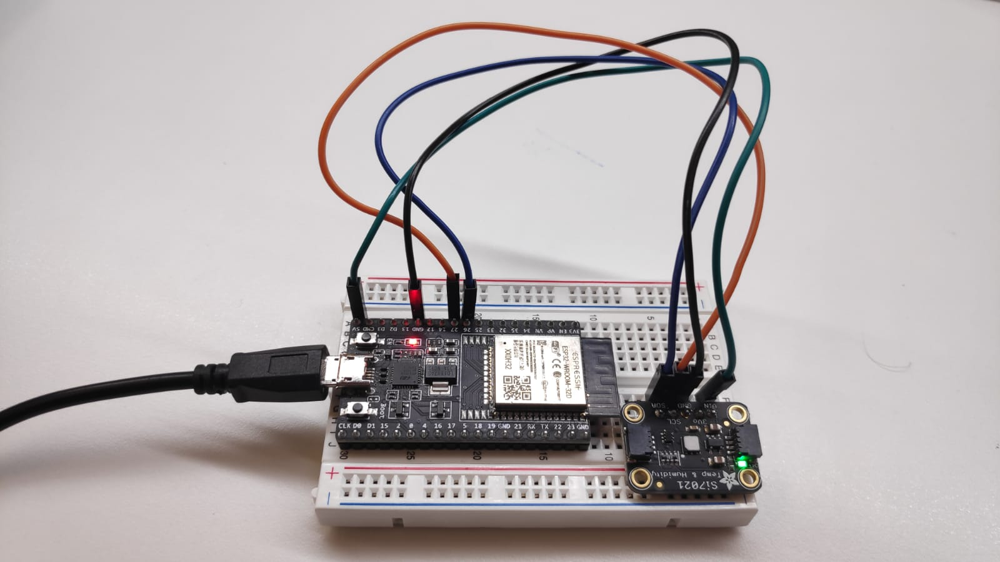
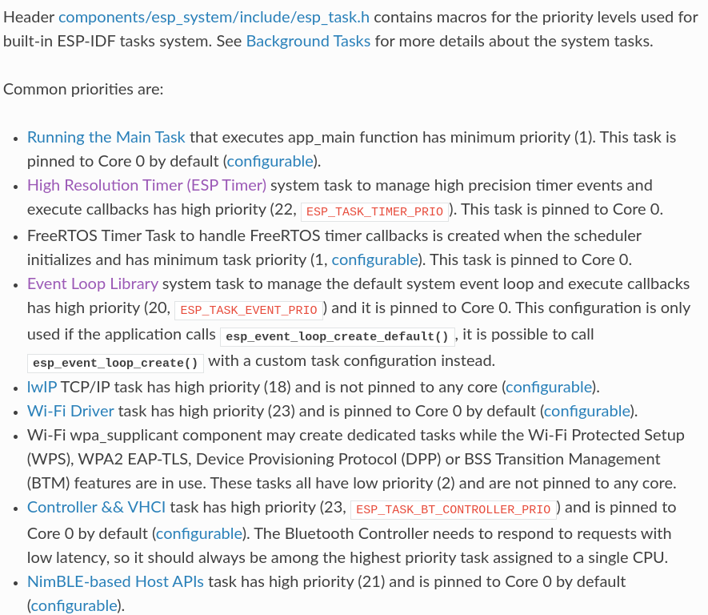
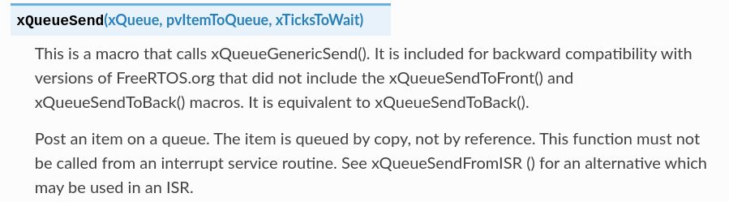
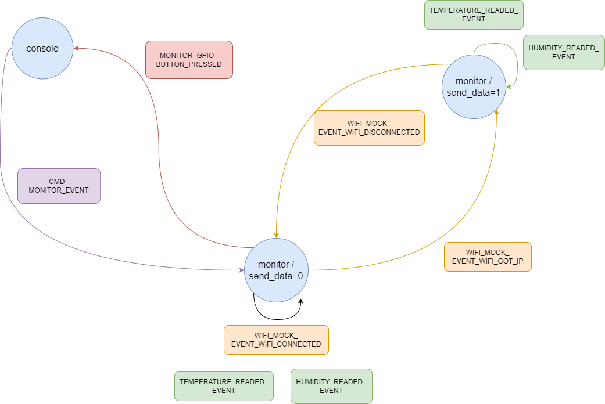

# Ejercicios básicos

## Ejercicio 1 - Creación de una tarea para realizar un muestreo

>Tarea
>
>La tarea creada leerá el valor del sensor con un período que se pasará como argumento a la tarea. La tarea inicial recogerá el valor muestreado y lo mostrará por puerto serie.

Para poder llevar a cabo el siguiente ejercicio, el primer paso será definir las variables que necesitamos utilizar mediante el menú de configuración. En este caso únicamente necesitaremos definir dos: 
 - El intervalo de muestreo para llevar a cabo la medición. 
 - La prioridad con la que crearemos la tarea que realice la medición del sensor.

En el siguiente cuadro podemos ver la definición de las variables en el menú de configuración:

```C
menu "Example Configuration"

    config READ_PERIOD
        int "Periodo de lectura"
        range 1 60
        default 2
        help
            Define el periodo de lectura, medido en segundos, con el que se obtienen datos desde el sensor Si7021.

    config TASK_PRIORITY
        int "Prioridad de la tarea encargada de realizar el muestreo"
        range 1 22
        default 5
        help
            Define la prioridad de la tarea que lleva a cabo el muestreo del sensor Si7021.

endmenu
```

Una vez definidas las variables de configuración, crearemos la función main, la cual será ejecutada por la tarea principal y cuya finalidad es la de mostrar el resultado de la medición (que se llevará a cabo en la tarea secundaria) mediante el uso de una variable global. Para esto necesitaremos crear primero la tarea secundaria mediante la función **xTaskCreate()** o **xTaskCreatePinnedToCore()**.

Ambas funciones difieren únicamente en la posibilidad de indicar el núcleo exclusivo que ejecutará dicha tarea, por lo que podemos utilizarlas de forma indiferente en este ejercicio (más información [aquí](https://docs.espressif.com/projects/esp-idf/en/v4.3/esp32/api-reference/system/freertos.html)). Los parámetros pasados a las mismas son:
 1) Función asociada a la tarea.
 2) Identificador de la tarea.
 3) Tamaño de la pila de la tarea.
 4) Parámetros de entrada de la tarea (los cuales deben ser formateados posteriormente).
 5) La prioridad de la tarea.
 6) La función manejadora del evento de finalización de dicha tarea.
 7) Identificador del núcleo (0 o 1) que se encargará de la ejecución de la tarea (parámetro exclusivo de la función **xTaskCreatePinnedToCore()**).

Una vez creada la tarea secundaria, únicamente tendremos que entrar en un bucle infinito para la lectura de la variable global encargada del almacenamiento de la temperatura.

```C
static const char *TAG = "ej1_sampling";
static float temperature = 0;

void app_main(void)
{
    
    i2c_master_init();
    xTaskCreatePinnedToCore(&taskFunction, "TareaMuestreo", 3072, (void *) READ_PERIOD, TASK_PRIORITY, NULL, 0);

    while(1){
        vTaskDelay(READ_PERIOD*1000 / portTICK_PERIOD_MS);
        ESP_LOGI(TAG, "Prioridad tarea Main: %d segundos.  Temperatura: %f", uxTaskPriorityGet(NULL), temperature);
    }
    vTaskDelete(NULL);
}
```

Por otra parte, también necesitaremos definir la función ejecutada por la tarea secundaria encargada de la medición de temperatura mediante el sensor **si7021**. Esta función unicamente necesitará entrar en un bucle infinito donde medir la temperatura del sensor mediante la llamada a al función **readTemperature()**. En el siguiente cuadro podemos ver el contenido de dicha función.

```C
void taskFunction(void *parameters){

    int period = (int) parameters;
    while(1){
        readTemperature(I2C_MASTER_NUM, &temperature);
        ESP_LOGI(TAG, "Prioridad tarea Secundaria: %d.    Periodo de lectura %d segundos.", uxTaskPriorityGet(NULL), period);
        vTaskDelay(period*1000 / portTICK_PERIOD_MS);
    }
    vTaskDelete(NULL);
}
```
Para poder llevar a cabo la ejecución necesitaremos realizar un montaje de nuestro sistema, para lo cual utilizaremos los siguientes componentes:
 - 1 STM32.
 - 1 Sensor de temperatura y humedad si7021.

 Por otra parte, las conexiones realizadas son las siguientes:
 - Sensor si7021, pin SDA <-(Cable azul)-> STM32, pin GPIO 26
 - Sensor si7021, pin SCL <-(Cable naranja)-> STM32, pin GPIO 27
 - Sensor si7021, pin GND <-(Cable negro)-> STM32, pin GND
 - Sensor si7021, pin VIN <-(Cable verde)-> STM32, pin 5V

En la siguiente imagen podemos ver un ejemplo de montaje correspondiente a las especificaciones anteriores.



Una vez realizado el montaje del sistema, podremos ejecutarlo para obtener la siguiente salida, en la que podremos ver como es la tarea secundaria la que realiza la lectura y como es la principal la que la muestra por pantalla. También podemos observas información adicional como la prioridad de dichas tareas o el tiempo de muestreo configurable por el usuario.

```BASH
I (342) main_task: Calling app_main()
I (342) ej1_sampling: ** Prioridad de la tarea Main: 1 **
I (442) ej1_sampling: Prioridad tarea Secundaria: 5.    Periodo de lectura 2 segundos.
I (2342) ej1_sampling: Prioridad tarea Main: 1 segundos.  Temperatura: 37.202591
I (2542) ej1_sampling: Prioridad tarea Secundaria: 5.    Periodo de lectura 2 segundos.
I (4342) ej1_sampling: Prioridad tarea Main: 1 segundos.  Temperatura: 37.181141
I (4642) ej1_sampling: Prioridad tarea Secundaria: 5.    Periodo de lectura 2 segundos.
I (6342) ej1_sampling: Prioridad tarea Main: 1 segundos.  Temperatura: 37.159691
```

>Cuestión
>
>- ¿Qué prioridad tiene la tarea inicial que ejecuta la función app_main()? ¿Con qué llamada de ESP-IDF podemos conocer la prioridad de una tarea?

En Espressif, cada tarea tiene asociada una prioridad específica, la cual se indica mediante un número entero entre 1 y 23, de modo que cuanto mayor sea este, mayor prioridad tendrá dicha tarea. Por defecto, Espressif asocia a cada tarea creada una prioridad concreta dependiendo del tipo de la misma. En la siguiente imagen podemos ver un pequeño resumen sobre la prioridad asociada por defecto a las diferentes tareas según el tipo del que sean (más información [aquí](https://docs.espressif.com/projects/esp-idf/en/latest/esp32/api-guides/performance/speed.html)):



Como podemos ver tanto en la documentación oficial de Espressif como en la salida obtenida del ejercicio, la tarea que ejecuta la función **app_main()** recibe una prioridad 1, es decir, la menor posible. Esto es con el objetivo de que no acabe por dejar en inanición al resto de posibles tareas, tanto creadas por el usuario como generadas automáticamente por el sistema.

Para obtener la prioridad de una determinada tarea utilizamos la función **uxTaskPriorityGet()**, la cual invocamos dentro de las funciones de cambas tareas y como nos devuelve un valor concreto para cada una. En el siguiente cuadro podemos ver la información sobre dicha función, obtenida directamente de la documentación de FreeRTOS (más información [aquí](https://www.freertos.org/a00128.html)):

```TXT
UBaseType_t uxTaskPriorityGet( TaskHandle_t xTask );

INCLUDE_uxTaskPriorityGet must be defined as 1 for this function to be available. See the RTOS Configuration documentation for more information. Obtain the priority of any task.

Parameters:
xTask 	Handle of the task to be queried. Passing a NULL handle results in the priority of the calling task being returned.

Returns:
The priority of xTask.
```

>Cuestión
>
>- ¿Cómo sincronizas ambas tareas? ¿Cómo sabe la tarea inicial que hay un nuevo dato generado por la tarea muestreadora?

Tal y como se encuentra diseñado el ejercicio actual, no existe ningún punto de sincronización entre ambas tareas que le permita la tarea principal saber cuando se ha registrado una nueva temperatura por parte de la tarea secundaria. Esto quiere decir que ambas tareas están constantemente escribiendo y leyendo dicha variable sin saber si esta ha sido interaccionada o no por la otra tarea, lo cual es posible gracias a que en Espressif las tareas comparten un mismo ámbito de variables.

Debemos tener en cuenta que debido a que Espressif otorga la ejecución a aquellas tareas que con mayor prioridad, de modo que la tarea principal únicamente pasará a estado **running** cuando la tarea que realiza la lectura de la temperatura, la cual tiene una mayor prioridad, pase a un estado **suspended** o **blocked**. Esto quiere decir que mientras la tarea secundaria se encuentra escribiendo en la variable global que registra la temperatura, la parea principal encargada de leerla, al tener una menor prioridad, no podrá acceder a la misma.

En el caso de que se quisiera que la tarea principal lea la temperatura únicamente cuando esta ha sido actualizada por la tarea que la mide, deberemos implementar un mecanismo de sincronización como las colas, o en su defecto semáforos.

>Cuestión
>
>- Si además de pasar el período como parámetro, quisiéramos pasar como argumento la dirección en la que la tarea muestreadora debe escribir las lecturas, ¿cómo pasaríamos los dos argumentos a la nueva tarea?

Debemos tener en cuenta que las funciones **xTaskCreate()** o **xTaskCreatePinnedToCore()** encargadas de crear tareas, reciben un parámetro el cual pasarán a la función asociada a la ejecución de dicha tarea que van a crear. Este parámetro es del tipo ``(void *)`` lo que nos quiere decir que le podemos agregar cualquier tipo de dato, con la condición de que para poder utilizarlo lo formateemos previamente.

Dicho esto, una opción viable para pasar más de un argumento como parámetro de entrada a una tarea es la creación de una estructura que podamos formatear una vez se ha invocado a la misma. En el siguiente bloque podemos ver un ejemplo de esto:

```C
struct Data{
    int par1;
    float par2;
    char * par3;
}Data;

void fuctionTask(void *parameters){
    Data data = (struct Data *) parameters;
    printData(data);
}

```

# Ejercicio 2 - Comunicación mediante colas

>Tarea
>
>La tarea creada (muestreadora) recibirá como argumento el período de muestreo y la cola en la que deberá escribir los datos leídos.

En este ejercicio vamos a actualizar el anterior para que la comunicación entre los dos procesos se realize a través de una cola de mensajes, de manera que la tarea muestreadora sea la encargada de ir introduciendo en la misma las diferentes lecturas realizadas, y la tarea principal nos muestre por pantalla dichas actualizaciones cunado se produzcan. De esta manera no será necesario emplear el uso de una variable global en la que operen ambas tareas.

Debido a que en este caso tenemos que enviar a la tarea muestreadora más información, necesitaremos crear una estructura donde poder almacenar todos los parámetros enviados, los cuales serán tanto el periodo de muestreo como la variable que guarda la información a cerca de la cola utilizada para la comunicación entre ambas tareas. En la siguiente imagen podemos ver la declaración de dicha estructura:

```C
struct taskParam{
    QueueHandle_t queue;
    int period;
}TaskParam;
```

Una vez declarada la estructura, en la función **app_main()** necesitaremos crear la cola utilizada para el paso de mensajes entre ambas tareas, lo cual se lleva a cabo mediante la función **xQueueCreate()**, cuyos parámetros son los siguientes:
 - 1) Número de elementos máximos que pueden estar almacenados en la cola.
 - 2) Tipo de datos que se almacenarán en la cola.

Posteriormente, la estructura que hemos declarado se pasará como parámetro en la creación de la tarea muestreadora. Una vez se entre en el bucle infinito, donde se realizará la lectura periódica de la cola de mensajes, se depositarán los datos sobre las mediciones de temperatura realizadas. Esto se llevará a cabo a través de la función **xQueueReceive()**, cuyos parámetros serán:
 - 1) Variable que guarda la información sobre la cola de la cual se realizará la lectura.
 - 2) Variable en la que guardará la información leída de la cola (esta variable debe ser del tipo de datos guardado en la cola).
 - 3) Tiempo máximo especificado en milisegundos que se esperará entre lectura y lectura (Este debe indicarse mediante una variable del tipo TickType_t).

Una vez realizada la lectura, se comprobará si esta ha tenido éxito, y de ser así se imprimirá un mensaje por pantalla. En caso contrario, gracias al bucle infinito, se volverá a llevar a cabo el proceso de lectura de la cola. En el siguiente cuadro podemos ver el fragmento de código correspondiente a la función **app_main()**, donde se llevan a cabo los pasos mencionados:

```C
void app_main(void)
{

    i2c_master_init();
    QueueHandle_t queue = xQueueCreate(QUEUE_SIZE, sizeof(float));
    struct taskParam params = {
        .queue=queue, 
        .period=READ_PERIOD
    };
    float readValue = 0.0;
    BaseType_t statusReturn;
    const TickType_t ticksToWait = pdMS_TO_TICKS(100);

    xTaskCreatePinnedToCore(&taskFunction, "TareaMuestreo", 3072, (void *) &params, TASK_PRIORITY, NULL, 0);
    ESP_LOGI(TAG, "***Tarea Principal preparada. Prioridad: %d.***", uxTaskPriorityGet(NULL));
    while(1){
        statusReturn =  xQueueReceive(queue, &readValue, ticksToWait);
        if(statusReturn == pdTRUE){
            ESP_LOGI(TAG, "Temperatura: %f", readValue);
        }
    }
    vTaskDelete(NULL);
}
```

En lo referente a la función ejecutada por al tarea muestreadora, podemos ver como el casteo de los parámetros recibidos en la creación de dicha tarea ahora se realiza en base al tipo de dato ``struct taskParam`` y como en lugar de imprimir la realización de la lectura en cada una de la iteraciones del bucle infinito, se guarda dicha información en la cola empleada para la comunicación entre procesos. Esto se lleva a cabo a través de la función **xQueueSendToBack()** cuya finalidad es introducir un nuevo elemento al final de la cola y la cual recibe los siguientes parámetros:
 - 1) Variable que guarda la información sobre la cola de la cual se realizará la lectura.
 - 2) Variable cuya información se introducirá al final de la cola.
 - 3) Tiempo de espera máximo para llevar a cabo la introducción de información en la cola (Este debe indicarse mediante una variable del tipo TickType_t y puede ser 0 para un tiempo indefinido).

```C
void taskFunction(void *parameters){

    struct taskParam *params = (struct taskParam *) parameters;
    float temperature = 0.0;

    ESP_LOGI(TAG, "***Tarea Secundaria (muestradora) preparada. Prioridad: %d. Periodo: %d s.***", uxTaskPriorityGet(NULL), params->period);
    while(1){
        readTemperature(I2C_MASTER_NUM, &temperature);
        xQueueSendToBack(params->queue, &temperature, 0);
        vTaskDelay(params->period*1000 / portTICK_PERIOD_MS);
    }
    vTaskDelete(NULL);
}
```

Una vez establecido todo lo anterior, llevaremos a cabo la ejecución dee programa para visualizar el resultado obtenido. Como podemos observar en el siguiente cuadro, se ha limpiado la información imprimida, de modo que ahora únicamente se muestran los datos de prioridad y periodo de muestreo al inicio de ejecución de las tareas, dejando únicamente a la impresión periódica, por parte de la tarea principal, la temperatura leída desde la cola de mensajes:

```BASH
I (342) main_task: Calling app_main()
I (342) ej2_comunication`: ***Tarea Secundaria (muestradora) preparada. Prioridad: 5. Periodo: 2 s.***
I (352) ej2_comunication`: ***Tarea Principal preparada. Prioridad: 1.***
I (452) ej2_comunication`: Temperatura: 26.874321
I (2552) ej2_comunication`: Temperatura: 26.895771
I (4652) ej2_comunication`: Temperatura: 26.885046
```

>Cuestión
>
>Al enviar un dato por una cola, ¿el dato se pasa por copia o por referencia?. Consulta la documentación para responder.

Para responder correctamente a esta cuestión debemos de tener en cuenta que la introducción de los datos en la cola se llevan a cabo en la función **xQueueSend()** y sus derivadas, pero esto no quiere decir que el dato se introduzca de la misma manera que lo proporcionamos a dichas funciones. 

Dicho esto, podemos ver que el dato es proporcionado a la función mediante referencia, lo cual es necesario debido a que debemos proporcionar un puntero a cualquier tipo de dato (``void *``). Sin embargo, si leemos la documentación de dichas funciones, podemos ver que se especifica como se introduce una copia del dato en la cola y no únicamente su referencia (más información [aquí](https://docs.espressif.com/projects/esp-idf/en/v5.0/esp32/api-reference/system/freertos.html)).



## Ejercicio 3 - Uso de eventos

>Tarea
>
>La tarea creada (muestreadora) recibirá como argumento el período de muestreo. Cuando tenga una nueva muestra, la comunicará a través de esp_event_post_to(). La tarea inicial registrará un handler que se encargará de escribir en el puerto serie.

Para llevar a cabo la presente tarea, utilizaremos como base el primer ejercicio y lo completaremos implementado todo lo relacionado para la gestión de eventos, con la que llevaremos a cabo la comunicación entre procesos.

El primer paso a desarrollar será la definición de los eventos que vamos a utilizar para poder notificar las lecturas de temperatura llevadas a cabo por al tarea muestreadora. Para esto necesitaremos crear el nuevo fichero **main/event_source** y especificar dentro del mismo tanto la familia de eventos que vamos a crear como cada uno de los ID que definirán todos los posibles eventos que utilizaremos.

En el siguiente cuadro podemos ver el contenido de dicho fichero, donde se puede ver que la familia creada se denominará **HALL_EVENT** y únicamente se especifica un único ID (**HALL_EVENT_NEWSAMPLE**), el cual será lanzado cuando se produzca una nueva lectura de temperatura.

```C
#ifndef EVENT_SOURCE_H_
#define EVENT_SOURCE_H_

#include "esp_event.h"
#include "esp_timer.h"

#ifdef __cplusplus
extern "C" {
#endif

// Declarations for the event source
#define TASK_ITERATIONS_COUNT        10      // number of times the task iterates
#define TASK_PERIOD                  500     // period of the task loop in milliseconds

ESP_EVENT_DECLARE_BASE(HALL_EVENT);         // declaration of the task events family


enum {
    HALL_EVENT_NEWSAMPLE                     // raised during an iteration of the loop within the task
};

#ifdef __cplusplus
}
#endif

#endif // #ifndef EVENT_SOURCE_H_
```

Antes de seguir con desarrollo, para poder habilitar el uso de eventos necesitaremos especificar en el fichero **CMakeLists.tst** de aquél componente que los utilice, el uso tanto del componente **esp_event** como de **esp_timer**. En el siguiente cuadro podemos ver el contenido de dicho fichero:

```C
idf_component_register( SRCS "i2c_config.c" "main.c"
                        INCLUDE_DIRS "."
                        REQUIRES "driver" "esp_event" "esp_timer")
```

Una vez hecho esto podemos centrarnos en el desarrollo del código principal. Lo primero que debemos hacer será incluir el nuevo fichero donde hemos definidos los eventos a utilizar y la biblioteca **esp_event_base** la cual nos proporciona acceso a las funciones básicas para el uso de eventos. Además, también deberemos definir la variable global encargada de la gestión del **eventLoop** y especificar el uso de la clase de eventos **ALL_EVENT** mediante la función **ESP_EVENT_DEFINE_BASE**.

```C
#include "event_source.h"
#include "esp_event_base.h"
.
.
.
static const char *TAG = "ej3_events";
static esp_event_loop_handle_t eventLoop;
ESP_EVENT_DEFINE_BASE(HALL_EVENT);
```

Pasando a la función **app_main()**, la cual será ejecutada por la tarea principal, necesitaremos desarrollar los siguientes pasos en lo que a la gestión de eventos se refiere:
1) Definir la estructura **esp_event_loop_args_t**, la cual especificará las características del **eventLoop** encargado de comprobar los eventos a los cuales nos vamos a suscribir.
2) Crear el **eventLoop** en base a la variable **esp_event_loop_handle_t** definida con ámbito global y a la estructura **esp_event_loop_args_t** especificada en el paso anterior.
3) Suscribirnos a los eventos que utilizaremos para notificar las nuevas lecturas de temperatura mediante la función **esp_event_handler_register_with()**.

Una vez llevados a cabo estos pasos, únicamente necesitaremos proseguir con la creación de la tarea muestreadora de la misma manera que en los ejercicios anteriores. En el siguiente cuadro podemos ver el fragmento de código correspondiente a la función **app_main()**:

```C
void app_main(void)
{

    float temperature=0.0;
    esp_event_loop_args_t eventLoop_args ={
        .queue_size = 10,
        .task_name = "eventLoop_task",
        .task_priority = uxTaskPriorityGet(NULL),
        .task_stack_size = 3072,
        .task_core_id = tskNO_AFFINITY
    };
    esp_event_loop_create(&eventLoop_args, &eventLoop);
    esp_event_handler_register_with(eventLoop, HALL_EVENT, HALL_EVENT_NEWSAMPLE, event_handler, eventLoop);

    i2c_master_init();
    xTaskCreatePinnedToCore(&taskFunction, "TareaMuestreo", 3072, (void *) READ_PERIOD, TASK_PRIORITY, NULL, 0);
    
    ESP_LOGI(TAG, "***Tarea Principal preparada. Prioridad: %d.***", uxTaskPriorityGet(NULL));
    vTaskDelete(NULL);
}
```

El siguiente paso se trata de la definición de la función manejadora que tratará el evento de lectura de la temperatura. Esta función define, entre sus varios parámetros de entrada, dos diferentes para el paso de información, el primero especificado desde el registro del evento (el cual nos permite saber desde que tarea se esta ejecutando la manejadora) y el segundo enviado junto al lanzamiento del evento (el cual nos permite obtener información de la tarea que ha lanzado el evento).

En el siguiente cuadro podemos ver la definición de la manejadora, donde comprobamos que su ejecución este vinculada a la tarea principal mediante el uso del parámetro `registerArgs`. En caso afirmativo, imprimimos la temperatura, la cual ha sido enviada desde la tarea muestreadora al lanzar el evento en el parámetro `eventArgs` con el tipo `void *`, luego necesitaremos también realizar un casteo al tipo de dato adecuado antes de utilizarlo.

```C
void event_handler(void *registerArgs, esp_event_base_t baseEvent, int32_t idEvent, void *eventArgs){

    float temperature=0.0f;
    if(registerArgs == eventLoop){
        temperature = *(float *)eventArgs;
        ESP_LOGI(TAG, "Temperatura: %f", temperature);    
    }else{
        ESP_LOGI(TAG, "Evento lanzado desde el lugar equivocado."); 
    }
}
```

Para finalizar necesitaremos especificar la función vinculada a la tarea muestreadora, cuyo contenido es muy similar al ejercicio base, con la diferencia de que debemos lanzar un evento cada vez que realizamos una lectura de la temperatura con la función **esp_event_post_to()**, dentro de la cual debemos especificar el evento a lanzar y pasar como parámetro la temperatura leída.

También observamos como la tarea muestreadora recibe el periodo de muestreo desde por parámetros desde la tarea principal. En el siguiente cuadro podemos ver dicha función y los elementos indicados de la misma:

```C
void taskFunction(void *parameters){

    int period = (int) parameters;
    float temperature = 0.0;
    ESP_LOGI(TAG, "***Tarea Secundaria (muestradora) preparada. Prioridad: %d. Periodo: %d s.***", uxTaskPriorityGet(NULL), period);
    while(1){
        readTemperature(I2C_MASTER_NUM, &temperature);
        esp_event_post_to(eventLoop, HALL_EVENT, HALL_EVENT_NEWSAMPLE, &temperature, sizeof(temperature), 0);
        vTaskDelay(period*1000 / portTICK_PERIOD_MS);
    }
    vTaskDelete(NULL);
}
```

Una vez realizados todos los pasos anteriores, únicamente necesitaremos ejecutar la aplicación para comprobar los resultados. En el siguiente cuadro podemos ver la salida de la misma y como se realiza correctamente tanto la lectura de la temperatura como su impresión por pantalla.

```BASH
 (330) app_start: Starting scheduler on CPU0
I (335) app_start: Starting scheduler on CPU1
I (335) main_task: Started on CPU0
I (345) main_task: Calling app_main()
I (345) ej3_events: ***Tarea Secundaria (muestradora) preparada. Prioridad: 5. Periodo: 2 s.***
I (355) ej3_events: ***Tarea Principal preparada. Prioridad: 1.***
I (455) ej3_events: Temperatura: 26.177191
I (2555) ej3_events: Temperatura: 26.187916
I (4655) ej3_events: Temperatura: 26.166466
I (6755) ej3_events: Temperatura: 26.187916
```

>Cuestión
>
>¿Qué debe hacer la tarea inicial tras registrar el handle? ¿Puede finalizar?

Tras la creación del **eventLoop** y registro de la función manejadora que atenderá al evento que lanzaremos al leer la temperatura, la tarea encargada principal deberá crear a la tarea muestreadora y asignar su ejecución a la función que define su comportamiento, siendo en nuestro caso **taskFunction()**. Una vez hecho esto, la función principal puede terminar sin problemas, pues aún quedan varias tareas ejecutándose que gobiernan el uso de la aplicación, siendo en este caso dos:
- La tarea muestreadora que lee la temperatura y lanza el evento definido para ello.
- La tarea asociada al **eventLoop**, la cual esta comprobando continuamente el lanzamiento de eventos y crea las diferentes tareas que ejecutaran las funciones manejadoras asociadas a dichos eventos.

Es importante tener en cuenta que si finalizamos la tarea principal sin que se hubieran creado ninguna otra que gobierne la aplicación, el sistema detectaría esto y tendríamos un error que reiniciaría la ejecución constantemente. En nuestro caso, haber creado concretamente la tarea muestreadora evita esto.


<br />

# Ejercicio 4 - Estructuración de código

>Tarea
>
>Escribe una aplicación que realice la funcionalidad anterior. Se valorará especialmente la modularidad y estructura del código, de modo que sea extensible y reutilizable.

En la siguiente imagen podemos ver una descripción del funcionamiento general de la función principal que implementa el funcionamiento indicado en el enunciado. Recordar que dentro de la carpeta donde se ha definido cada componente (**components/"nombreComponente"/readme.md**) podemos encontrar la guía de uso del mismo, en la que se explican las diferentes funciones, eventos y variables de configuración que han sido definidas.



