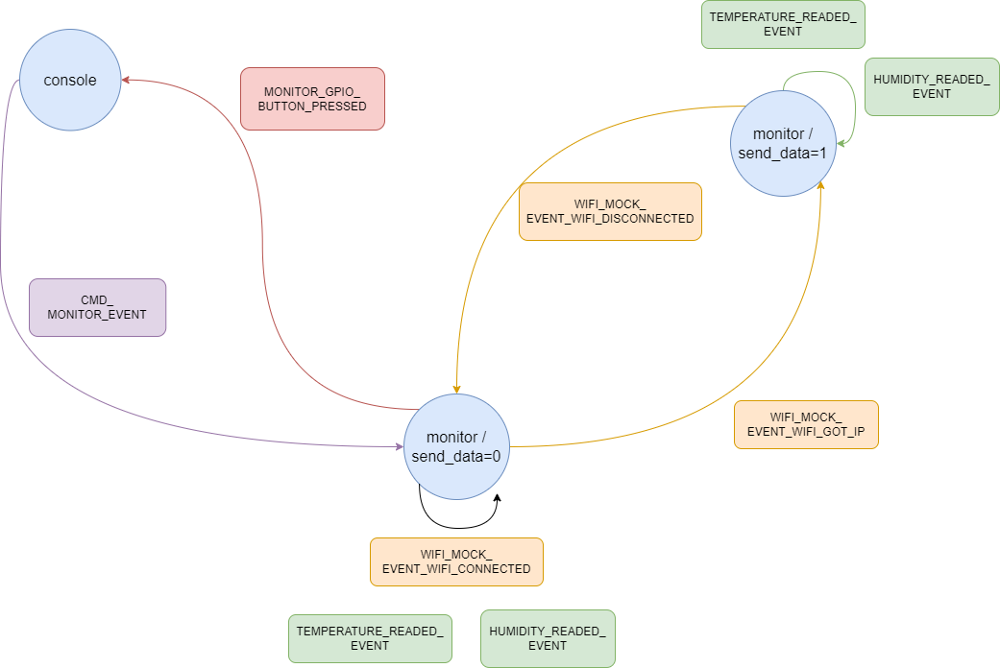

# Ejercicio 4 - Estructuración de código

>Tarea
>
>Escribe una aplicación que realice la funcionalidad anterior. Se valorará especialmente la modularidad y estructura del código, de modo que sea extensible y reutilizable.

En la siguiente imagen podemos ver una descripción del funcionamiento general de la función principal que implementa el funcionamiento indicado en el enunciado. Recordar que dentro de la carpeta donde se ha definido cada componente (components/"nombreComponente"/readme.md) podemos encontrar la guía de uso del mismo, en la que se explican las diferentes funciones, eventos y variables de configuración que han sido definidas.

