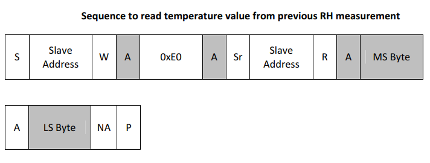
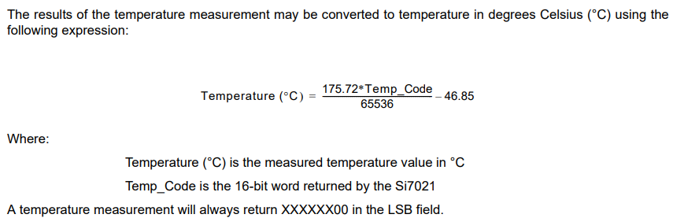

# PRÁCTICA 4 - Uso del bus I2C y del sensor de temperatura

>Cuestión
>
>La dirección del sensor es 1000000 (es decir, 0x40 expresado en hexadecimal). Si queremos hacer una operación de lectura (bit R/W a 1), ¿cómo construiremos el segundo argumento de la llamada a i2c_master_write_byte() que haremos tras i2c_master_start() ?

La función `i2c_master_write_byte()` únicamente puede utilizarse cuando el dispositivo se encuentra configurado en modo **master** y su función es introducir en la cola de mensajes I2C un único byte de escritura (más información [aquí](https://docs.espressif.com/projects/esp-idf/en/latest/esp32/api-reference/peripherals/i2c.html)). La función recibe tres parámetros, los cuales son relevantes de analizar:
 - 1) La lista de comandos I2c donde se introducirán los datos.
 - 2) Información que se introducirá en la lista especifica en la lista de comandos I2C.
 - 3) Flag para activar la señal ACK.

Una vez visto esto, sabemos que el tercer parámetro es constante y el primero depende de la cola I2C que estemos utilizando, por lo que es más relevante es el segundo. Teniendo en cuenta que se trata de la primera escritura, necesitaremos establecer el modo de operación, de modo que el contenido de este será diferente dependiendo de si lo que queremos hacer es leer desde o escribir hacia el esclavo, pero en ambos casos, dicho byte de información estará compuesto de la siguiente manera:
 - Los primero 7 bits harán referencia a la dirección del esclavo al cual se dirige la escritura/lectura.
 - El último bit dependerá del tipo de operación a realizar.

En el caso de Espressif, ya se encuentran definidas un par de macros para determinar si se produce una lectura o escritura, siendo estas **I2C_MASTER_READ** e **I2C_MASTER_WRITE** respectivamente. De esta manera, teniendo en cuenta que la dirección del dispositivo es de 7 bits, únicamente necesitaremos realizar un desplazamiento lateral de 1 bit sobre la variable que contiene dirección y operar mediante una puerta OR entre esta y la macro deseada.

En el siguiente cuadro tenemos un ejemplo sobre como sería la ejecución de dicha función para establecer una operación de lectura sobre el esclavo.

```C
i2c_master_write_byte(cmd, (ESP_SLAVE_ADDR << 1) | I2C_MASTER_READ, ACK_EN);
```


<br />

>Cuestión
>
>¿Cuál es la diferencia entre 0xE3 y 0xF3? ¿Qué es clock stretching?


Para comprender las diferencias entre los comandos 0xE3 y 0xF3 necesitamos entender que el dispositivo **si7021** realiza dos tipos diferentes de instrucciones de lectura:

- La primera se realiza de forma periódica para llevar a cabo una medida relativa de la humedad y temperatura. Esta es utilizada por el comando **0xE0**, el cuál devuelve dicha medida relativa, por lo que no necesita llevar a cabo una nueva medición en el momento de ser invocado.

- La segunda se lleva a cabo en el mismo instante en el que es solicitado realizar la medición, sin embargo, esta forma de medición cuenta a su vez con dos maneras de llevarse a cabo, cada una utilizada mediante un comando diferente:
    - La medición se lleva a cabo indicando al dispositivo maestro cuando esta se ha realizado (Hold Mode). Esta se realiza mediante el comando **0xE3**.
    - La medición se lleva a cabo sin asentimiento, indicando al dispositivo maestro que se encuentra en proceso (No Hold mode) **0xF3**.

Por otra parte, cuando hablamos de **clock stretching** estamos haciendo referencia al uso del **Hold Mode** a la hora de llevar a cabo una medición.


<br />

>Cuestión
>
>Dichos comandos devuelven 2 bytes, que leeremos en dos variables diferentes. ¿Cómo obtenemos posteriormente nuestro número de 16 bits para calcular la temperatura?

Para responder correctamente a la pregunta, necesitaremos fijarnos la sección de la documentación sobre el periférico **si7021** donde nos muestra el esquema de envío de tramas referente a la realización de una lectura de temperatura. En la siguiente imagen podemos ver dicho esquema.



La primera parte de la cadena se corresponde con la conexión y el establecimiento del modo de lectura mediante la escritura en el dispositivo. Por el contrario si nos fijamos en los dos últimos mensajes enviados por el sistema esclavo, el cuál esta escrito en un color más claro, podemos ver que estos son llamados MS Byte (Most Significant) y LS Byte (Least Significant), los cuales corresponden con el bit de mayor y menor valor significativamente.

Una vez hemos obtenido ambos bytes de información, únicamente necesitaremos juntarlos en una variable de 16 bits y operar para obtener la temperatura en grados mediante la siguiente fórmula:




<br />

## Ejercicio obligatorio - Uso de I2Ctools

>Ejercicio obligatorio
>
>Compila y prueba el ejemplo i2c_tools de la carpeta de ejemplos (examples/peripherals/i2c/i2c_tools). Conecta el sensor a los pines indicados por defecto (también a Vcc y a tierra) y ejecuta al comando i2cdetect. Prueba a los distintos comandos disponibles para tratar de leer información del sensor.

Para realizar el presente ejercicio, primero necesitaremos conectar el sensor **si7021** a los pines configurados por defecto dependiendo del SoC que estemos utilizando. Para esto podemos visualizar el fichero **README.md** del ejemplo, donde se nos indica cuales son las conexiones que deberemso llevar a cabo. En el siguiente cuadro podremos ver la configuración indicada:

```md
#### Pin Assignment:

**Note:** The following pin assignments are used by default, you can change them with `i2cconfig` command at any time.

|                     | SDA    | SCL    | GND  | Other | VCC  |
| ------------------- | ------ | ------ | ---- | ----- | ---- |
| ESP32 I2C Master    | GPIO18 | GPIO19 | GND  | GND   | 3.3V |
| ESP32-S2 I2C Master | GPIO18 | GPIO19 | GND  | GND   | 3.3V |
| ESP32-S3 I2C Master | GPIO1  | GPIO2  | GND  | GND   | 3.3V |
| ESP32-C3 I2C Master | GPIO5  | GPIO6  | GND  | GND   | 3.3V |
| ESP32-C2 I2C Master | GPIO5  | GPIO6  | GND  | GND   | 3.3V |
| ESP32-H2 I2C Master | GPIO1  | GPIO2  | GND  | GND   | 3.3V |
| Sensor              | SDA    | SCL    | GND  | WAK   | VCC  |

**Note:** It is recommended to add external pull-up resistors for SDA/SCL pins to make the communication more stable, though the driver will enable internal pull-up resistors.
```

Una vez ejecutado el ejemplo, podremos ver un menú de opciones que nos muestras los diferentes comandos a poder utilizar. Lo primero será realizar una configuración del puerto I2C donde especifiquemos las conexiones que vamos a realizar mediante la instrucción `12cconfig`". En el siguiente cuadro tenemso un ejemplo de configuración para nuestro SoC STM32:

```BASH
i2c-tools> i2cconfig --port=0 --sda=18 --scl=19 --freq=100000
```

Posteriormente utilizaremos la instrucción `i2cdetect`, cuyo propósito es escanear el bus I2C en busca de posibles dispositivos conectados al mismo. Como resultado obtenemos la siguiente salida en forma de cuadro, la cual nos indica que detecta un total de dos dispositivos, uno situado en la dirección 0x00 y otro en la dirección 0x40. Este último se trata de nuestro sensor de temperatura y humedad.

```BASH

i2c-tools> i2cdetect
     0  1  2  3  4  5  6  7  8  9  a  b  c  d  e  f
00: 00 -- -- -- -- -- -- -- -- -- -- -- -- -- -- -- 
10: -- -- -- -- -- -- -- -- -- -- -- -- -- -- -- -- 
20: -- -- -- -- -- -- -- -- -- -- -- -- -- -- -- -- 
30: -- -- -- -- -- -- -- -- -- -- -- -- -- -- -- -- 
40: 40 -- -- -- -- -- -- -- -- -- -- -- -- -- -- -- 
50: -- -- -- -- -- -- -- -- -- -- -- -- -- -- -- -- 
60: -- -- -- -- -- -- -- -- -- -- -- -- -- -- -- -- 
70: -- -- -- -- -- -- -- -- -- -- -- -- -- -- -- -- 
```

Una vez que ya conocemos la dirección del dispositivo, llevaremos a cabo una lectura del registro a utilizar mediante la instrucción `i2cget`, la cual nos devuelve el valor 0x00, puestoq ue el registro acaba de ser inicializado. En el siguiente cuadro podemos ver la salida de dicha ejecución:

```BASH
i2c-tools> i2cget -c 0x40 -r 0x00 -l 1
0x00 
```