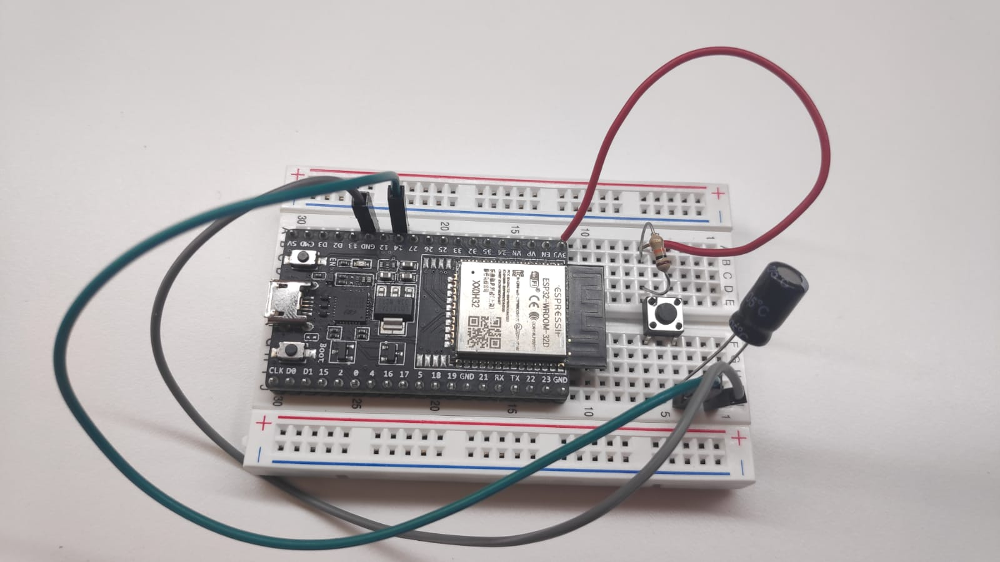
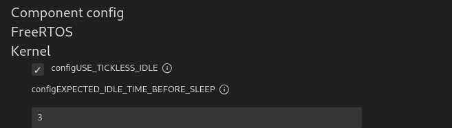

# PRÁCTICA 6 - Modos de bajo consumo


## Ejercicio 1 - Uso básico del modo Light Sleep

>Tareas
>
>Hacer funcionar el ejemplo, permitiendo que volvamos de light-sleep únicamente por un timer o por GPIO.

Para llevar a cabo el presente ejercicio vamos a utilizar como base el ejemplo **system/light_sleep**, el cual implementa la funcionalidad básica para llevar a nuestra placa a modo de ahorra de energía **light_sleep**, además de configurar una serie de fuentes que pueden ser utilizadas para despertar al sistema. En nuestro caso utilizare únicamente dos de ellas: El timer y el GPIO.

El primer paso para poder desarrollar el proyecto será e montaje de los componentes hardware necesarios para su funcionamiento, los cuales vienen especificados en el fichero **README.md** del ejemplo. Sin embargo, estos se pueden resumir en los siguientes:
- Un SoC compatible con el ejemplo.
- Un interruptor, para poder interaccionar con el pin GPIO que despertará la placa.
- Una resistencia de pull-up de 10k ohmios.
- Un capacitador de 100nF para evitar rebotes.

El montaje debe llevarse a cabo conectando el interruptor en serie con la resistencia de pull-up, ambos realizando un enlace entre el pin de 3.3v y el pin GPIO especificado para despertar a la placa. Por otra parte, el capacitador debe conectarse al interruptor y a tierra, de la misma manera que puede verse en al siguiente imagen: 



Una vez realizado el montaje, vamos a ligeramente el ejemplo para poder determinar como se llevarán a cabo los eventos que despierten la placa. En nuestro caso vamos a especificar que el timer que lleva a cabo el proceso de despertar de forma periódica se lleve a cabo cada 5 segundos, mientras que el pin GPIO utilizado para poder utilizar nuestro interruptor será el número 14 (esto teniendo en cuenta que estamos utilizando una placa ESP32 y sobre todo por contar con una mayor comodidad a la hora de ejecutar el ejemplo).

En los siguientes cuadros podemos ver cambas especificaciones mediante el uso de variables globales, las cuales se encuentran en lso ficheros **timer_wakeup.c** y **gpio_wakeup.c** respectivamente:

```C
#define TIMER_WAKEUP_TIME_US    (5 * 1000 * 1000)
```

```C
#if CONFIG_IDF_TARGET_ESP32C3 || CONFIG_IDF_TARGET_ESP32C2 || CONFIG_IDF_TARGET_ESP32H2 \
    || CONFIG_IDF_TARGET_ESP32C6
#define BOOT_BUTTON_NUM         9
#else
#define BOOT_BUTTON_NUM         14
#endif
```

Una vez hecho esto, estamos listos para comprobar el funcionamiento de nuestro código. De este modo, en el siguiente cuadro podemos ver un ejemplo de ejecución que nos muestra tanto el despertar periódico cada 5 segundos como el uso del pin GPIO mediante el interruptor para poder llevar a cabo el despertar de la placa cuando nosotros queramos.

En el siguiente cuadro podemos ver la salida obtenida tras ejecutar el programa de ejemplo. Debemos fijarnos en como el timer periódico despierta el SoC cada 5 segundos, mientras que en la parte central de la salida podemos apreciar como se ha llevado a cabo el despertar mediante el pulsador y como se rompe la secuencialidad establecida cuando este no es utilizado.

```BASH
I (361) main_task: Calling app_main()
I (361) gpio: GPIO[14]| InputEn: 1| OutputEn: 0| OpenDrain: 0| Pullup: 0| Pulldown: 0| Intr:0 
Waiting for GPIO14 to go high...
I (371) gpio_wakeup: gpio wakeup source is ready
I (381) timer_wakeup: timer wakeup source is ready
I (381) uart: queue free spaces: 20
I (401) uart_wakeup: uart wakeup source is ready
Entering light sleep
Returned from light sleep, reason: timer, t=5094 ms, slept for 5000 ms
Entering light sleep
Returned from light sleep, reason: timer, t=10103 ms, slept for 5000 ms
Entering light sleep
Returned from light sleep, reason: timer, t=15111 ms, slept for 5000 ms
Entering light sleep
Returned from light sleep, reason: pin, t=13511 ms, slept for 3399 ms
Waiting for GPIO14 to go high...
Entering light sleep
Returned from light sleep, reason: pin, t=13531 ms, slept for 3 ms
Waiting for GPIO14 to go high...
Entering light sleep
Returned from light sleep, reason: pin, t=13552 ms, slept for 2 ms
Waiting for GPIO14 to go high...
Returned from light sleep, reason: timer, t=20120 ms, slept for 5000 ms
Entering light sleep
Returned from light sleep, reason: timer, t=25129 ms, slept for 5000 ms
```

<br />

>Cuestión
>
>¿Qué número de GPIO está configurado por defecto para despertar al sistema? ¿Está conectado dicho GPIO a algún elemento de la placa ESP Devkit-c que estamos usando? Puedes tratar de responder consultando el esquemático de la placa

En nuestro caso hemos llevado a cabo una modificación del pin GPIO utilizado para despertar la placa (sobre todo por comodidad), sin embargo, en el siguiente cuadro podemos ver la configuración establecida por defecto y como esta depende del modelo concreto de placa que estemos utilizando. En nuestro caso, teniendo en cuenta que estamos utilizado el SoC ESP32, el pin utilizado por defecto es el número 0.

```C
#if CONFIG_IDF_TARGET_ESP32C3 || CONFIG_IDF_TARGET_ESP32C2 || CONFIG_IDF_TARGET_ESP32H2 \
    || CONFIG_IDF_TARGET_ESP32C6
#define BOOT_BUTTON_NUM         9
#else
#define BOOT_BUTTON_NUM         0
#endif
```

Teniendo en cuenta esto, en la siguiente imagen obtenida del siguiente [enlace](https://docs.espressif.com/projects/esp-idf/en/latest/esp32/hw-reference/esp32/get-started-devkitc.html), podemos ver todos los elementos a los que se encuentran conectados todos y cada uno de los pines GPI de los que disponemos en el SoC en dicho SoC:


De esta manera manera podemos ver como el pin GPIO 0 esta conectado a varios elementos de la placa, los cuales a demás son utilizados en el presente ejemplo. Dichos elementos son los siguientes:
- **El convertidor Analógico-Digital 1**.
- **El sensor táctil 1**, el cual es utilizado para poder despertar la placa mediante un panel táctil (según se indica en la memoria del ejemplo).
- **El Control de BOOT**.


<br />

>Cuestión
>
>¿Qué flanco provocará que salgamos de light-sleep tras configurar el GPIO con `gpio_wakeup_enable(GPIO_WAKEUP_NUM, GPIO_WAKEUP_LEVEL == 0 ? GPIO_INTR_LOW_LEVEL : GPIO_INTR_HIGH_LEVEL)` ?

Para poder responder a esta pregunta primero miraremos los manuales de Espressif referentes a la configuración de los pines GPIO RTC, al cual podemos acceder en el siguiente (enlace)[https://docs.espressif.com/projects/esp-idf/en/latest/esp32/api-reference/peripherals/gpio.html]. En la siguientes imágenes podemos ver tanto la descripción de la función mencionada en el enunciado como de las dos macros utilizadas para definir el nivel de tensión en el que se lanzará el proceso para despertar la placa.


Visto que el segundo argumento es aquel que define el tipo de tensión en el que se ejecutará ducho proceso, y que este se encuentra especificado según la variable `GPIO_WAKEUP_LEVEL`, podemos determinar en base a su valor original, el cual se puede ver en el siguiente cuadro, que el proceso de salida del light-sleep mediante GPIO se produce por el flanco de bajada.

```C
/* Use boot button as gpio input */
#define GPIO_WAKEUP_NUM         BOOT_BUTTON_NUM
/* "Boot" button is active low */
#define GPIO_WAKEUP_LEVEL       1
```


<br />

## Ejercicio 2 - Uso de timers en el modo Light Sleep

>Tareas
>
>Incluir un timer en el código. La aplicación arrancará, configurará un timer para que se ejecute su callback cada 0.5 segundos, y se dormirá durante 3 segundos (con vTaskDelay() ). Tras despertar del delay, pasará a light-sleep (configuraremos el mecanismo de despertar para que lo haga en 5 segundos, si no usamos el GPIO correspondiente). El callback del timer simplemente imprimirá un mensaje que incluirá el valor devuelto por esp_timer_get_time() 

En el presente ejercicio modificaremos el código de ejemplo para que se lleven a cabo los siguientes pasos:
 1) Realizar una configuración inicial donde se registren los métodos para despertar al SoC y el timer periódico que imprimirá el tiempo.
 2) Llevar a cabo un periodo donde el SoC se encuentre dormido por 3 segundos.
 3) Entrar en el modo Deep Sleep.
 4) Salir del modo Deep Sleep debido al timer configurado para despertar al SoC o la pulsación del botón mediante GPIO.
 5) Finalizamos la ejecución.

Debemos tener en cuenta que en este caso el timer encargado de imprimir el tiempo no debe estar configurado para despertar al SoC, por lo que deben convivir dos timers distintos en la aplicación.

Teniendo en cuenta lo dicho anteriormente, tanto el primer como el segundo paso se realizarán dentro de la función ejecutada por la tarea que lleva a cabo la entrada en el modo Light Sleep, antes de que este se lleva a cabo. Para ello necesitaremos crear el timer y asociarlo a la función encargada de imprimir el mensaje de manera periódica. En el siguiente cuadro podremos ver dicha configuración:


```C
#define TIME_TO_SLEEP_AFTER_INITIAL_CONFIGURATION 3000
#define TIMER_PRINTTIME_PERIOD 500000


void timerHandler_printTime(){
    printf("Timer de ejecución periódica. Tiempo: %lld\n", esp_timer_get_time());
    return;
}


static void light_sleep_task(void *args){

    const esp_timer_create_args_t periodic_timer_args = {
        .callback = &timerHandler_printTime,
        .name = "timer_printTime"};
    esp_timer_handle_t periodic_timer;
    esp_timer_create(&periodic_timer_args, &periodic_timer);
    esp_timer_start_periodic(periodic_timer, TIMER_PRINTTIME_PERIOD);


    printf("Comenzamos a dormir después de la configuración inicial\n");
    vTaskDelay( TIME_TO_SLEEP_AFTER_INITIAL_CONFIGURATION / portTICK_PERIOD_MS);
    printf("Finalizamos de dormir después de la configuración inicial\n");  
```

Para la correcta visualización del ejercicio, hemos decidido que no se vuelva a entrar en el modo Light Sleep una vez se ha salido del mismo. Para esto deberemos romper el bucle en el que se encuentra la tarea y eliminar tanto el timer creado para la impresión de los mensajes como todos aquellos recursos establecidos para despertar el sistema. En el siguiente cuadro podemos ver dicha configuración situada al final de la función `light_sleep_task()`:

```C
    printf("Finalizando ejecución.\n");
    esp_timer_stop(periodic_timer);
    esp_timer_delete(periodic_timer);
    printf("Timer periódico eliminado.\n");
    esp_sleep_disable_wakeup_source(ESP_SLEEP_WAKEUP_ALL);
    printf("Fuentes para despertar el SoC eliminadas.\n");
    printf("Programa finalizado con éxito.\n");
    
    vTaskDelete(NULL);
}
```

Una vez hecho esto y configurado el timer que despierta al SoC cada 5 segundos, ejecutamos el ejemplo y obtenemos la siguiente salida, donde podemos ver la ejecución periódica del timer mediante los mensajes que este imprime por pantalla:

```BASH
I (361) main_task: Calling app_main()
I (361) gpio: GPIO[14]| InputEn: 1| OutputEn: 0| OpenDrain: 0| Pullup: 0| Pulldown: 0| Intr:0 
Waiting for GPIO14 to go high...
I (371) gpio_wakeup: gpio wakeup source is ready
I (381) timer_wakeup: timer wakeup source is ready
I (381) uart: queue free spaces: 20
I (401) uart_wakeup: uart wakeup source is ready
I (401) main_task: Returned from app_main()
Comenzamos a dormir después de la configuración inicial
Timer de ejecución periódica. Tiempo: 579867
Timer de ejecución periódica. Tiempo: 1079831
Timer de ejecución periódica. Tiempo: 1579831
Timer de ejecución periódica. Tiempo: 2079831
Timer de ejecución periódica. Tiempo: 2579831
Timer de ejecución periódica. Tiempo: 3079831
Finalizamos de dormir después de la configuración inicial
Timer de ejecución periódica. Tiempo: 8086219
Timer de ejecución periódica. Tiempo: 8086425
Timer de ejecución periódica. Tiempo: 8086610
Timer de ejecución periódica. Tiempo: 8087699
Timer de ejecución periódica. Tiempo: 8091879
Timer de ejecución periódica. Tiempo: 8096046
Timer de ejecución periódica. Tiempo: 8100212
Timer de ejecución periódica. Tiempo: 8104379
Timer de ejecución periódica. Tiempo: 8108545
Timer de ejecución periódica. Tiempo: 8112712
Returned from light sleep, reason: timer, t=8091 ms, slept for 5004 ms
Finalizando ejecución.
Timer periódico eliminado.
Fuentes para despertar el SoC eliminadas.
Programa finalizado con éxito.
```


<br />


>Cuestión
>
>¿Qué observas en la ejecución de los timer?¿Se ejecutan en el instante adecuado? ¿Se pierde alguno?

Si analizamos la salida obtenida anteriormente haciendo incapié en los mensajes correspondientes al timer que imprime el tiempo, podemos ver como hay una gran alteración en su funcionamiento entre el periodo en el que el sistema se encuentra durmiendo mediante la función `vTaskDelay()` y cuando el mismo entra en el estado Light Sleep.

En la primera fase, cuando el sistema se encuentra unicamente dormido por `vTaskDelay()`, podemos apreciar como los mensajes del timer se siguen imprimiendo respetando los tiempos marcados por el el mismo. Por el contrario, durante el periodo en el que el sistema esta en estado Light Sleep, dichos mensajes no son imprimidos por pantalla, sin embargo, estos som imprimidos todos de manera automática cuando se abandona dicho modo y, como es evidente, sin respeta los tiempos marcados por el timer.

Dicho esto, podemos sacar tres conclusiones del análisis:
- Los timer siguen funcionando aunque la tarea se encuentra parada mediante `vTaskDelay()`, los cual es debido a que cuando este se ejecuta, una nueva tarea es la encargada de ejecutar la función handler asignada al mismo.
- Cuando el SoC se encuentra en modo Light Sleep no se ejecutan las funciones handler vinculadas a los timer, puesto que los recursos de la CPU se ven limitados y no se puede llevar a cabo la creación del hilo que ejecuta dicha función.
- Aunque el sistema se encuentre en Light Sleep, los eventos producidos por los timers no se pierden, sino que estos permanecen en la cola correspondiente hasta que el sistema despierta, los detecta y pasa a atenderlos.


<br />

## Ejercicio 3 - Uso básico del modo Deep Sleep

>Tareas
>
>Modifica el código anterior para que, tras 5 pasos por ligth-sleep, pasemos a deep-sleep. Incluye código para determinar el motivo por el que hemos despertado de deep-sleep y muéstralo por pantalla.

Para llevar a cabo el presente ejercicio hemos incluido una invocación al modo Deep Sleep una vez se ha llevado a cabo un total de 3 veces la salida del modo Light Sleep. En el siguiente cuadro podemos ver la sección en la que se declara dicha invocación:

```C
printf("\n\n\n***Entramos en el modo Deep Sleep\n");  

uart_wait_tx_idle_polling(CONFIG_ESP_CONSOLE_UART_NUM);
int64_t t_before_us = esp_timer_get_time();
esp_deep_sleep_start();
```

Una vez hecho esto, en el siguiente cuadro tenemos un ejemplo de la salida obtenida de la ejecución, donde podemos ver las diferentes impresiones periódicas de temperatura debido al timer y la entrada posterior al modo Deep Sleep:

```BASH
I (363) main_task: Calling app_main()
I (363) gpio: GPIO[14]| InputEn: 1| OutputEn: 0| OpenDrain: 0| Pullup: 0| Pulldown: 0| Intr:0 
Waiting for GPIO14 to go high...
I (373) gpio_wakeup: gpio wakeup source is ready
I (383) timer_wakeup: timer wakeup source is ready
I (383) uart: queue free spaces: 20
I (403) uart_wakeup: uart wakeup source is ready
Comenzamos a dormir después de la configuración inicial
I (403) main_task: Returned from app_main()
Timer de ejecución periódica. Tiempo: 2079866
Finalizamos de dormir después de la configuración inicial
*** Entramos en el modo Light Sleep ***
Timer de ejecución periódica. Tiempo: 8085788
Timer de ejecución periódica. Tiempo: 8086003
Timer de ejecución periódica. Tiempo: 8086216
*** Despertamos del modo Light Sleep (1), motivo: timer, t=8087 ms. Se ha dormido por 5001 ms ***

*** Entramos en el modo Light Sleep ***
Timer de ejecución periódica. Tiempo: 13109347
Timer de ejecución periódica. Tiempo: 13109570
*** Despertamos del modo Light Sleep (2), motivo: timer, t=13109 ms. Se ha dormido por 4998 ms ***

*** Entramos en el modo Light Sleep ***
Timer de ejecución periódica. Tiempo: 18130254
Timer de ejecución periódica. Tiempo: 18130477
Timer de ejecución periódica. Tiempo: 18130681
*** Despertamos del modo Light Sleep (3), motivo: timer, t=18132 ms. Se ha dormido por 5001 ms ***


***Entramos en el modo Deep Sleep
ets Jun  8 2016 00:22:57

rst:0x5 (DEEPSLEEP_RESET),boot:0x13 (SPI_FAST_FLASH_BOOT)
configsip: 0, SPIWP:0xee
clk_drv:0x00,q_drv:0x00,d_drv:0x00,cs0_drv:0x00,hd_drv:0x00,wp_drv:0x00
mode:DIO, clock div:2
load:0x3fff0030,len:7084
ho 0 tail 12 room 4
load:0x40078000,len:15584
load:0x40080400,len:4
0x40080400: _init at ??:?

load:0x40080404,len:3872
entry 0x4008064c
I (31) boot: ESP-IDF v5.1.1-dirty 2nd stage bootloader
```


<br />

>Cuestión
>
>¿Qué diferencia se observa al volver de deep-sleep respecto a volver de light-sleep?

Como podemos observar en el cuadro anterior, tras la entrada en el modo Deep Sleep, cuando el timer de wakeup periódico salta, en lugar de continuar con la ejecución de la aplicación, se produce un reinicio completo del SoC. Esto es debido a que el modo Deep Sleep anula la tensión de entrada que recibe el procesador principal del SoC con el objetivo de reducir el consumo del mismo, lo cual provoca que no se pueda mantener el estado del sistema y cuando se intente despertar sea necesario reiniciar el sistema.

Debemos tener en cuenta, que cuando se produce un reinicio debido a que el SoC se esta despertando del modo Deep Sleep, este se produce de una forma ordenada y queda registro del motivo por el cual se esta realizando, lo cual podemos ver en la primera línea de la salida anterior una vez se ha comenzado el proceso de reinicio:

```BASH
rst:0x5 (DEEPSLEEP_RESET),boot:0x13 (SPI_FAST_FLASH_BOOT)
```


<br />

## Ejercicio 4 - Estructuración 2

>Tareas
>
>Completar la aplicación de modo que:
>1) Se configure el gestor de energía para que entre automáticamente en light-sleep cuando sea posible.
>2) Tras 12 horas de funcionamiento, pasará al modo deep-sleep durante otras 12 horas (para pruebas, en lugar de 12 horas probadlo con 1 minuto).
>3) Compruebe el motivo por el que se produce cada reinicio y lo anote en NVS.
>4) Escriba en NVS la última medida del sensor tomada.

Para llevar a cabo el presente ejercicio con mayor claridad, se estructurará el desarrollo del mismo en base a diferentes pasos que coinciden con los indicados en el enunciado. El desarrollo del primer paso, se puede realizar de dos maneras diferentes:
- Configurar los distintos eventos lanzados por el sistema para que estos despierten el SoC y gestionar manualmente la entrada en el modo Light Sleep.
- Utilizar el **Power Manager (PM)** para llevar a acabo la entrada automática en el modo Light Sleep.

Para llevar a cabo el desarrollo del presente proyecto se ha optado por la implementación de la segunda opción, es decir, que la entrada al modo Light Sleep sea gestionada automáticamente por el PM. Sin embargo, también se ha llevado a cabo la desarrollo de un segundo ejercicio donde se ha realizado únicamente la gestión manual de la entrada al Light Sleep, de este modo, podemos ver como se deberían hacer ambos métodos.

Esto quiere decir que el presente ejercicio esta conformado por dos proyectos: El primero implementa toda la funcionalidad del ejercicio y es denominado **ej4_estructurcion2**, mientras que el segundo únicamente implementa la gestión manual de entrada al Light Sleep y se denomina **ej4_estructuracion2_sinPM**. A continuación analizaremos ambos ejercicios


<br />

### Paso 1A - Entrada al Light Sleep con gestión manual

Para llevar a cabo esto necesitaremos modificar los siguientes aspectos del ejercicio original, con el objetivo de que podamos saber cuando entrar y salir del Light Sleep:
- Los eventos periódicos de lectura y tempera de humedad deben ser timer de wakeup.
- La pulsación del botón para pasar al modo consola debe ser un GPIO wakeup.
- El módulo WIFI debe conectarse y desconectarse al salir y entrar del modo Light Sleep, respectivamente.
- Se debe dar a conocer al Soc cuando este tiene vía libre para poder dormirse.

Para cambiar los eventos emitidos por el componente **monitor-temperature** por eventos de wakeup, deberemos modificarlos dentro de la función **temperatureMonitor_init()**, donde especificaremos el periodo con el que se llevará a cabo el despertar del SoC con el objetivo de leer la temperatura y la humedad. En el siguiente cuadro podemos ver la definición de dichos timer de wakeup:

```C
//Definición del timer de Wakeup
ESP_RETURN_ON_ERROR(esp_sleep_enable_timer_wakeup(us_read_period), TAG, "ERROR..: No se pudo configurar el timer Wakeup para la lectura de temperatura y humedad.");
```

Para implementar el GPIO wakeup que despertará al SoC cada vez que se quiera entrar en el modo consola, deberá registrarse en el componente **monitor-gpio** dentro de la función **monitorGPIO_init()**. En el siguiente cuadro podemos ver la configuración de dicho wakeup.

```C
gpio_config_t config = {
        .pin_bit_mask = BIT64(BUTTON_GPIO_PORT),
        .mode = GPIO_MODE_INPUT,
        .pull_down_en = false,
        .pull_up_en = true,
        .intr_type = GPIO_INTR_DISABLE
};

status = gpio_config(&config);
if(status != ESP_OK){
    ESP_LOGE(TAG, "ERROR..: No se pudo llevar a cabo la inicialición del GPIO %d", BUTTON_GPIO_PORT);
}

status = gpio_wakeup_enable(BUTTON_GPIO_PORT, GPIO_WAKEUP_LEVEL == 0 ? GPIO_INTR_LOW_LEVEL : GPIO_INTR_HIGH_LEVEL);
if(status != ESP_OK){
    ESP_LOGE(TAG, "ERROR..: No se pudo habilitar el GPIO wakeup");
}

status = esp_sleep_enable_gpio_wakeup();
if(status != ESP_OK){
    ESP_LOGE(TAG, "ERROR..: No se pudo configurar el GPIO wakeup");
}

/* Make sure the GPIO is inactive and it won't trigger wakeup immediately */
example_wait_gpio_inactive();
ESP_LOGI(TAG, "GPIO wakeup inicializado con éxito.");
```

Por otra parte, gestionar la conexión y desconexión del módulo WIFI cada vez que se entra y sale del modo Light Sleep se implementa dentro de la función **sleepTask_function()** en el fichero **sleepTask.c**. En el siguiente cuadro tenemos la sección de código correspondiente a la entrada dentro del modo Light Sleep y a la gestión de la salida del mismo por las distintas vías que están programadas para ello. Podemos ver como antes de llevar a cano la entrada al modo Light Sleep, se llama a función que desconecta el módulo WIFI, mientras que cuando el SoC es despertado, la primera acción es volver a conectar dicho módulo.

```C
ESP_LOGI(TAG, "Preparándose para entrar en modo Light Sleep.");
wifi_disconnect();
ESP_LOGI(TAG, "Entrando en modo Light Sleep.\n");
uart_wait_tx_idle_polling(CONFIG_ESP_CONSOLE_UART_NUM);
esp_light_sleep_start();


switch (esp_sleep_get_wakeup_cause()) {
    case ESP_SLEEP_WAKEUP_TIMER:
        ESP_LOGI(TAG, "Saliendo del modo Light Sleep. Motivo: Timer wakeup.");
        wifi_connect();
        TemperatureMonitor_readTemperatureAndHumidity();
        break;

    case ESP_SLEEP_WAKEUP_GPIO:
        ESP_LOGI(TAG, "Saliendo del modo Light Sleep. Motivo: GPIO wakeup.");
        wifi_connect();
        gpio_timer_callback(NULL);
        break;

    default:
        ESP_LOGI(TAG, "Saliendo del modo Light Sleep. Motivo: Desconocido.");
        xQueueSendToBack(queue, &readValue, 0);
        break;
}
```

El último paso será dar a conocer al SoC cuando se han llevado ac abo todas las acciones necesarias y se puede volver a entrar en el modo Light Sleep sin problemas. Para esto se empleará un buzón l cual se accederá cada vez que el SoC se despierte y después de que se hayan invocado las acciones a realizar. Cada vez que el sistema este listo para volver a dormirse, se comunicará a la tarea que gestiona la entrada a dicho modo mediante el uso de dicho buzón.

En el siguiente cuadro podemos ver la sección donde se comprueba dicho buzón con el objetivo de volver al modo Light Sleep, el cual tiene un periodo máximo de espera de 10 segundos y se encuentra el final de la función **sleepTask_function()** en el fichero **sleepTask.c**.

```C
statusReturn =  xQueueReceive(queue, &readValue, pdMS_TO_TICKS(10000));
if(statusReturn != pdTRUE){
    ESP_LOGE(TAG, "ERROR (%d): No se pudo leer de la cola de retorno al modo Light Sleep. Se pasará al modo forzosamente", statusReturn);
}
```

Una vez hecho todo esto, el sistema esta listo para entrar en el modo Light Sleep cada vez que sea necesario (salvando ciertos problemas referentes con el paralelismo pero que quedan fuera del alcance de la presente práctica), por que en el siguiente cuadro podemos evr ejemplo de al salida del mismo:

```BASH
I (390) MAIN: Comenzando inicialización de componentes.
I (390) MOCK_WIFI: Wifi Initialized
I (5400) MOCK_WIFI: Wifi Connected
I (5400) MAIN: WIFI CONNECTED
I (5400) BUFFER: Buffer correctamente inicializado.
I (5400) gpio: GPIO[25]| InputEn: 1| OutputEn: 0| OpenDrain: 0| Pullup: 1| Pulldown: 0| Intr:0 
I (5410) MONITOR-GPIO: Esperando por que el GPIO 25 vuelva a su posición original.
I (5410) MONITOR-GPIO: GPIO 25 Ha restablecido su posición original.
I (5420) MONITOR-GPIO: GPIO wakeup inicializado con éxito.
I (5430) MAIN: Finalizada inicialización de los componentes. Creando tarea para la gestión del modo Light Sleep
I (5440) MAIN: Preparándose para entrar en modo Light Sleep.
I (5450) MOCK_WIFI: Wifi Disconnected, call wifi_connect() to reconnect
I (5450) MAIN: Entrando en modo Light Sleep.

I (5470) MAIN: Saliendo del modo Light Sleep. Motivo: Timer wakeup.
I (10470) MOCK_WIFI: Wifi Connected
I (10470) MOCK_WIFI: Direccion IP obtenida
I (10470) MAIN: WIFI CONNECTED
I (10470) MAIN: WIFI GOT IP
I (15670) MOCK_WIFI: Wifi Connected
I (15670) MAIN: WIFI CONNECTED
I (15670) MAIN: Temperatura: 23.828394
I (15670) MAIN: Humedad: 54.474396
I (15680) MAIN: Preparándose para entrar en modo Light Sleep.
I (15690) MOCK_WIFI: Wifi Disconnected, call wifi_connect() to reconnect
I (15700) MAIN: Entrando en modo Light Sleep.
```


<br />

### Paso 1B - Entrada al Light Sleep mediante el Power Manager

Esta opción es la utilizada para el desarrollo del resto del ejercicio y a la vez la más simple de implementar, puesto que únicamente necesitaremos configurar el **Power Manager** mediante una estructura del tipo **esp_pm_config_t**. El código referente a dicha configuración podemos verlo en el siguiente cuadro, el cual se encuentra al principio de la función **app_main()** y contiene especificadas las frecuencias a las cuales trabajará el sistema y la capacidad de entrar en el modo Light Sleep siempre que sea posible:

```C
esp_pm_config_t pmConfig = {
    .max_freq_mhz = 240,
    .min_freq_mhz = 10,
    .light_sleep_enable = true
};
result = esp_pm_configure(&pmConfig);
if (result != ESP_OK){
    ESP_LOGE(TAG, "ERROR (%s)..: No se pudo configurar adecuadamente el Power Manager", esp_err_to_name(result));
    vTaskDelete(NULL);
}
```

Para que esto pueda funcionar correctamente necesitaremos habilitar las opciones **CONFIG_PM_ENABLE** y **CONFIG_FREERTOS_USE_TICKLESS_IDLE** desde el menú de configuración del proyecto. En las siguientes imágenes podemos ver como se ha llevado a cabo dicha configuración:




Una vez se ha llevado a cabo la configuración correctamente y se ejecuta la aplicación, podemos ver como una de las primeras líneas obtenidas nos indica que se han cambiado las frecuencias de trabajo y se ha activado la entrada automática al modo Light Sleep. En el siguiente cuadro podemos ver dicha salida:

```BASH
I (404) main_task: Calling app_main()
I (404) pm: Frequency switching config: CPU_MAX: 240, APB_MAX: 240, APB_MIN: 10, Light sleep: ENABLED
I (404) MAIN: Comenzando inicialización de componentes.
```

### Paso 2 - Entrada en el modo Deep Sleep

Para la realización del segundo paso deberemos definir una variable global donde indiquemos el tiempo que transcurrirá entre cada entrada del SoC al modo Deep Sleep. Teniendo en cuenta lo que indica el enunciado, hemos creado dos definiciones para dicha variable, la primera con una duración de 1 minuto y la segunda con 12 horas. En el siguiente cuadro podemos ver dichas variables que se encuentran en el fichero **main.c**.

```C
#define TIME_TO_DEEP_SLEEP 1 * 60 * 1000000         // Espera de 1 minuto
//#define TIME_TO_DEEP_SLEEP 12 * 3600 * 1000000    // Espera de 12 horas
```

Posteriormente crearemos y configuraremos el timer que necesitamos para poder controlar el acceso al modo Deep Sleep, lo cual se realizará en la función **app_main()** durante el proceso de inicialización. En el siguiente cuadro podemos ver dicha sección dle código:

```C
    //Configuración del evento de entrada al modo Deep Sleep
    const esp_timer_create_args_t deepSleep_timer_args = {
        .callback = &deepSleep_event_handler,
        .name = "temperature"};

    result = esp_timer_create(&deepSleep_timer_args, &deepSleep_timer);
    if (result != ESP_OK){
        ESP_LOGE(TAG, "ERROR (%s)..: No se pudo crear el timer para la entrada en el Deep Sleep.", esp_err_to_name(result));
        vTaskDelete(NULL);
    }
    
    result = esp_timer_start_periodic(deepSleep_timer, TIME_TO_DEEP_SLEEP);
    if (result != ESP_OK){
        ESP_LOGE(TAG, "ERROR (%s)..: No se pudo activar el timer para acceso al Deep Sleep.", esp_err_to_name(result));
        vTaskDelete(NULL);
    }
    ESP_LOGI(TAG, "El timer de acceso al modo Deep Sleep ha sido configurado adecuadamente.");
```

Por otra parte, la función encargada de ejecutarse cuando el timer es lanzado debe desconectar tanto el módulo WIFI como pausar los diferentes componentes que fueron configurados inicialmente con el objetivo de que la aplicación despierte cuando el timer vuelva a ser ejecutado y no antes. Además, también necesitaremos crear un timer específico de wakeup que despierte al SoC tras haber pasado el tiempo ue se considera oportuno. A continuación podemos ver la definición de dicha función:

```C
static void deepSleep_event_handler(){

    int32_t lastValue;
    esp_err_t result;

    ESP_LOGI(TAG, "Tiempo de funcionamiento finalizado, preparandose para entrar en el modo Deep Sleep.");  
 
    result = esp_sleep_enable_timer_wakeup(TIME_TO_DEEP_SLEEP);
    if (result != ESP_OK){
        ESP_LOGE(TAG, "ERROR (%s)..: No se pudo activar el timer para despertar del modo Deep Sleep.", esp_err_to_name(result));
        vTaskDelete(NULL);
    }
    ESP_LOGI(TAG, "El timer para despertar del modo Deep Sleep ha sido configurado adecuadamente.");
 
    wifi_disconnect();
    circularBuffer_destroy();
    TemperatureMonitor_stop();
    monitor_gpio_stop();
    aniot_console_stop();
    nvs_commit(nvs_handle_custom);
    .
    .
    .
    nvs_close(nvs_handle_custom);
    
    ESP_LOGI(TAG, "Entrando en el modo Deep Sleep.\n");  

    uart_wait_tx_idle_polling(CONFIG_ESP_CONSOLE_UART_NUM);
    esp_deep_sleep_start();
}
```

Para finalizar, si ejecutamos la aplicación y esperamos el tiempo especificado en el timer, podemos ver como esta entra en el modo Deep Sleep y cuando se vuelve a producir el lanzamiento del timer, esta vuelve a despertar.

```BASH
I (30441) MAIN: Tiempo de funcionamiento finalizado, preparandose para entrar en el modo Deep Sleep.
I (30441) MAIN: El timer para despertar del modo Deep Sleep ha sido configurado adecuadamente.
I (30441) MOCK_WIFI: Wifi Disconnected, call wifi_connect() to reconnect
I (30451) BUFFER: Buffer correctamente eliminado.
.
.
.
I (30471) MAIN: Entrando en el modo Deep Sleep.

ets Jun  8 2016 00:22:57

rst:0x5 (DEEPSLEEP_RESET),boot:0x13 (SPI_FAST_FLASH_BOOT)
```


<br />

### PASO 3 - Comprobar el motivo del reinicio y guardarlo en la NVS

Para poder llevar a cabo este paso necesitaremos inicializar el módulo NVS, abriendo en el mismo un almacenamiento donde poder guardar nuestras claves par-valor. Esto lo llevaremos a cabo al principio de la función **app_main()** y para ello utilizaremos las funciones **nvs_flash_init()** y **nvs_open()** respectivamente. En el siguiente cuadro podemos ver dicho fragmento de código:

```C
// Configuración del NVS
result = nvs_flash_init();
while(result == ESP_ERR_NVS_NO_FREE_PAGES || result == ESP_ERR_NVS_NEW_VERSION_FOUND){
    ESP_ERROR_CHECK(nvs_flash_erase());
    result = nvs_flash_init();
}
if (result != ESP_OK){
    ESP_LOGE(TAG, "ERROR (%s)..: No se pudo inicializar adecuadamente el NVS.", esp_err_to_name(result));
    vTaskDelete(NULL);
}

result = nvs_open("storage", NVS_READWRITE, &nvs_handle_custom);
if (result != ESP_OK) {
    ESP_LOGE(TAG, "ERROR (%s)..: No se pudo abrir el almacenamiento NVS.", esp_err_to_name(result));
    vTaskDelete(NULL);
}

```

Por otra parte, una vz hemos realizado la inicialización del módulo NVS guardaremos sobre el mismo la información referente al motivo del reinicio del sistema, el cual obtenemos mediante la función **esp_sleep_get_wakeup_cause()**. Para comprobar el correcto guardado, realizaremos posteriormente una obtención de dicho valor y los imprimiremos por pantalla, para lo cual necesitaremos asegurarnos primero que se ha completado dicha escritura mediante la función **nvs_commit()**. En el siguiente cuadro de texto podemos ver dicho fragmento de código:

```C
wakeupCause = esp_sleep_get_wakeup_cause();
.
.
.
result = nvs_set_u8(nvs_handle_custom, "resetReason", (uint8_t) wakeupCause);
if (result != ESP_OK) {
    ESP_LOGE(TAG, "ERROR (%s)..: Error al guardar el motivo de reinicio en el NVS.", esp_err_to_name(result));
    vTaskDelete(NULL);
}

result = nvs_commit(nvs_handle_custom);
if (result != ESP_OK) {
    ESP_LOGE(TAG, "ERROR (%s)..: No se pudo realizar el commit porterior a la introducción dle motivo de reinicio.", esp_err_to_name(result));
    vTaskDelete(NULL);
}

uint8_t resetReason_value;
result = nvs_get_u8(nvs_handle_custom, "resetReason", &resetReason_value);
if (result != ESP_OK) {
    ESP_LOGE(TAG, "ERROR (%s)..: Error al intentar obtener el valor de reinicio almacenado en el NVS.", esp_err_to_name(result));
    //vTaskDelete(NULL);
}

ESP_LOGI(TAG, "Nuevo valor almacenado en el NVS. Motivo de reinicio (%d)..: %s.", resetReason_value, esp_sleep_source_types[resetReason_value]);
```

Una vez realizado esto ya tendremos el guardado en memoria del motivo de cada uno de los reinicios del sistema. En el siguiente cuadro podemos ver la información relevante al respecto de la ejecución de la aplicación:

```BASH
mI (399) main_task: Started on CPU0
I (409) main_task: Calling app_main()
I (409) MAIN: Motivo del reinicio: ESP_SLEEP_WAKEUP_UNDEFINED
I (409) MAIN: Comenzando el proceso de inicialización.
.
.
.
I (60391) MAIN: Entrando en el modo Deep Sleep.
I (60391) MOCK_WIFI: Wifi Disconnected, call wifi_connect() to reconnect
I (60391) BUFFER: Buffer correctamente eliminado.
ets Jun  8 2016 00:22:57

rst:0x5 (DEEPSLEEP_RESET),boot:0x13 (SPI_FAST_FLASH_BOOT)
.
.
.
mI (401) main_task: Started on CPU0
I (411) main_task: Calling app_main()
I (411) MAIN: Motivo del reinicio: ESP_SLEEP_WAKEUP_TIMER
I (411) MAIN: Comenzando el proceso de inicialización.
```

<br />

### PASO 4 - Guardado de las últimas lecturas de temperatura y humedad

Para la realización del último paso necesitaremos realizar inserciones en la sección NVS cada vez que llevemos a cabo la lectura de la temperatura o la humedad, dejando siempre prevalecer el último valor obtenido. Para esto necesitaremos haber inicializado previamente el módulo NVS, y la ejecución de las funciones **nvs_set_i32()** lo llevaremos a cabo dentro de la función encargada de manejar los eventos producidos cada vez que se realiza una lectura de temperatura o humedad. En el siguiente cuadro podemos ver dicho fragmento de código.

```C
data = *(float *)eventArgs;
if (idEvent == TEMPERATURE_READED_EVENT){
    ESP_LOGI(TAG, "Temperatura: %f", data);
    result = nvs_set_i32(nvs_handle_custom, "lastTemperature", (int32_t) data);
    if (result != ESP_OK) {
        ESP_LOGE(TAG, "ERROR (%s)..: Error al guardar la última temperatura leída.", esp_err_to_name(result));
        vTaskDelete(NULL);
    }
}else if (idEvent == HUMIDITY_READED_EVENT){
    ESP_LOGI(TAG, "Humedad: %f", data);
    result = nvs_set_i32(nvs_handle_custom, "lastHumidity", (int32_t) data);
    if (result != ESP_OK) {
        ESP_LOGE(TAG, "ERROR (%s)..: Error al guardar el motivo de reinicio en el NVS.", esp_err_to_name(result));
        vTaskDelete(NULL);
    }
    }else{
    ESP_LOGE(TAG, "ERROR..: ID del evento desconocida");
    return;
}
```

Por otra parte, para poder visualizar los últimos valores guardados se ha llevado a cabo la obtención de los mismos mediante las funciones **nvs_get_i32()** dentro de la función encargada de gestionar la entrada al modo Deep Sleep. Antes de esto debemos ejecutar la función **nvs_commit()** para asegurarnos de que los datos ya se encuentran correctamente almacenados en la sección NVS.

```C
    result = nvs_commit(nvs_handle_custom);
    if (result != ESP_OK) {
        ESP_LOGE(TAG, "ERROR (%s)..: No se pudo realizar el commit porterior a la introducción dle motivo de reinicio.", esp_err_to_name(result));
        vTaskDelete(NULL);
    }

    result = nvs_get_i32(nvs_handle_custom, "lastTemperature", &lastValue);
    if (result != ESP_OK) {
        ESP_LOGE(TAG, "ERROR (%s)..: Error al intentar obtener el último valor de temperatura almacenado en el NVS.", esp_err_to_name(result));
        //vTaskDelete(NULL);
    }
    ESP_LOGI(TAG, "Último valor de temperatura almacenado en el NVS..: %f.", (float) lastValue);

    result = nvs_get_i32(nvs_handle_custom, "lastHumidity", &lastValue);
    if (result != ESP_OK) {
        ESP_LOGE(TAG, "ERROR (%s)..: Error al intentar obtener el último valor de humedad almacenado en el NVS.", esp_err_to_name(result));
        //vTaskDelete(NULL);
    }
    ESP_LOGI(TAG, "Último valor de humedad almacenado en el NVS..: %f.", (float) lastValue);
```

A continuación tenemos el fragmento correspondiente a la salida obtenida al ejecutar la aplicación:

```BASH
I (30461) MAIN: Último valor de temperatura almacenado en el NVS..: 22.000000.
I (30471) MAIN: Último valor de humedad almacenado en el NVS..: 46.000000.
I (30471) MAIN: Entrando en el modo Deep Sleep.

ets Jun  8 2016 00:22:57

rst:0x5 (DEEPSLEEP_RESET),boot:0x13 (SPI_FAST_FLASH_BOOT)
```