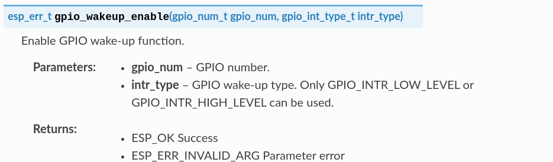

# PRÁCTICA 6 - Modos de bajo consumo


## Ejercicio 1 - Uso básico del modo Light Sleep

>Tareas
>
>Hacer funcionar el ejemplo, permitiendo que volvamos de light-sleep únicamente por untimer o por GPIO.

Para llevar a cabo el presente ejercicio vamos a utilizar como base el ejemplo **system/light_sleep**, el cual implementa la funcionalidad básica para llevar a nuestra placa a modo de ahorra de energía **light_sleep**, además de configurar una serie de fuentes que pueden ser utilizadas para despertar al sistema. En nuestro caso utilizare únicamente dos de ellas: El timer y el GPIO.

El primer paso para poder desarrollar el proyecto será e montaje de los componentes hardware necesarios para su funcionamiento, los cuales vienen especificados en el fichero **README.md** del ejemplo. Sin embargo, estos se pueden resumir en los siguientes:
- Un SoC compatible con el ejemplo.
- Un interruptor, para poder interaccionar con el pin GPIO que despertará la placa.
- Una resistencia de pull-up de 10k ohmios.
- Un capacitador de 100nF para evitar rebotes.

El montaje debe llevarse a cabo conectando el interruptor en serie con la resistencia de pull-up, ambos realizando un enlace entre el pin de 3.3v y el pin GPIO especificado para despertar a la placa. Por otra parte, el capacitador debe conectarse al interruptor y a tierra, de la misma manera que puede verse en al siguiente imagen: 


Una vez realizado el montaje, vamos a ligeramente el ejemplo para poder determinar como se llevarán a cabo los eventos que despierten la placa. En nuestro caso vamos a especificar que el timer que lleva a cabo el proceso de despertar de forma periódica se lleve a cabo cada 5 segundos, mientras que el pin GPIO utilizado para poder utilizar nuestro interruptor será el número 14 (esto teniendo en cuenta que estamos utilizando una placa STM32 y sobre todo por contar con una mayor comodidad a la hora de ejecutar el ejemplo).

En los siguientes cuadros podemos ver cambas especificaciones mediante el uso de variables globales, las cuales se encuentran en lso ficheros **timer_wakeup.c** y **gpio_wakeup.c** respectivamente:

```C
#define TIMER_WAKEUP_TIME_US    (5 * 1000 * 1000)
```

```C
#if CONFIG_IDF_TARGET_ESP32C3 || CONFIG_IDF_TARGET_ESP32C2 || CONFIG_IDF_TARGET_ESP32H2 \
    || CONFIG_IDF_TARGET_ESP32C6
#define BOOT_BUTTON_NUM         9
#else
#define BOOT_BUTTON_NUM         14
#endif
```

Una vez hecho esto, estamos listos para comprobar el funcionamiento de nuestro código. De este modo, en el siguiente cuadro podemos ver un ejemplo de ejecución que nos muestra tanto el despertar periódico cada 5 segundos como el uso del pin GPIO mediante el interruptor para poder llevar a cabo el despertar de la placa cuando nosotros queramos.

En el siguiente cuadro podemos ver la salida obtenida tras ejecutar el programa de ejemplo. Debemos fijarnos en como el timer periódico despierta el SoC cada 5 segundos, mientras que en la parte central de la salida podemos apreciar como se ha llevado a cabo el despertar mediante el pulsador y como se rompe la secuencialidad establecida cuando este no es utilizado.

```BASH
I (361) main_task: Calling app_main()
I (361) gpio: GPIO[14]| InputEn: 1| OutputEn: 0| OpenDrain: 0| Pullup: 0| Pulldown: 0| Intr:0 
Waiting for GPIO14 to go high...
I (371) gpio_wakeup: gpio wakeup source is ready
I (381) timer_wakeup: timer wakeup source is ready
I (381) uart: queue free spaces: 20
I (401) uart_wakeup: uart wakeup source is ready
Entering light sleep
Returned from light sleep, reason: timer, t=5094 ms, slept for 5000 ms
Entering light sleep
Returned from light sleep, reason: timer, t=10103 ms, slept for 5000 ms
Entering light sleep
Returned from light sleep, reason: timer, t=15111 ms, slept for 5000 ms
Entering light sleep
Returned from light sleep, reason: pin, t=13511 ms, slept for 3399 ms
Waiting for GPIO14 to go high...
Entering light sleep
Returned from light sleep, reason: pin, t=13531 ms, slept for 3 ms
Waiting for GPIO14 to go high...
Entering light sleep
Returned from light sleep, reason: pin, t=13552 ms, slept for 2 ms
Waiting for GPIO14 to go high...
Returned from light sleep, reason: timer, t=20120 ms, slept for 5000 ms
Entering light sleep
Returned from light sleep, reason: timer, t=25129 ms, slept for 5000 ms
```

<br />

>Cuestión
>
>¿Qué número de GPIO está configurado por defecto para despertar al sistema? ¿Está conectado dicho GPIO a algún elemento de la placa ESP Devkit-c que estamos usando? Puedes tratar de responder consultando el esquemático de la placa

En nuestro caso hemos llevado a cabo una modificación del pin GPIO utilizado para despertar la placa (sobre todo por comodidad), sin embargo, en el siguiente cuadro podemos ver la configuración establecida por defecto y como esta depende del modelo concreto de placa que estemos utilizando. En nuestro caso, teniendo en cuenta que estamos utilizado el SoC STM32, el pin utilizado por defecto es el número 0.

```C
#if CONFIG_IDF_TARGET_ESP32C3 || CONFIG_IDF_TARGET_ESP32C2 || CONFIG_IDF_TARGET_ESP32H2 \
    || CONFIG_IDF_TARGET_ESP32C6
#define BOOT_BUTTON_NUM         9
#else
#define BOOT_BUTTON_NUM         0
#endif
```

Teniendo en cuenta esto, en la siguiente imagen obtenida del siguiente [enlace](https://docs.espressif.com/projects/esp-idf/en/latest/esp32/hw-reference/esp32/get-started-devkitc.html), podemos ver todos los elementos a los que se encuentran conectados todos y cada uno de los pines GPI de los que disponemos en el SoC en dicho SoC:


De esta manera manera podemos ver como el pin GPIO 0 esta conectado a varios elementos de la placa, los cuales a demás son utilizados en el presente ejemplo. Dichos elementos son los siguientes:
- **El convertidor Analógico-Digital 1**.
- **El sensor táctil 1**, el cual es utilizado para poder despertar la placa mediante un panel táctil (según se indica en la memoria del ejemplo).
- **El Control de BOOT**.


<br />

>Cuestión
>
>¿Qué flanco provocará que salgamos de light-sleep tras configurar el GPIO con `gpio_wakeup_enable(GPIO_WAKEUP_NUM, GPIO_WAKEUP_LEVEL == 0 ? GPIO_INTR_LOW_LEVEL : GPIO_INTR_HIGH_LEVEL)` ?

Para poder responder a esta pregunta primero miraremos los manuales de Espressif referentes a la configuración de los pines GPIO RTC, al cual podemos acceder en el siguiente (enlace)[https://docs.espressif.com/projects/esp-idf/en/latest/esp32/api-reference/peripherals/gpio.html]. En la siguientes imágenes podemos ver tanto la descripción de la función mencionada en el enunciado como de las dos macros utilizadas para definir el nivel de tensión en el que se lanzará el proceso para despertar la placa.




Visto que el segundo argumento es aquel que define el tipo de tensión en el que se ejecutará ducho proceso, y que este se encuentra especificado según la variable `GPIO_WAKEUP_LEVEL`, podemos determinar en base a su valor original, el cual se puede ver en el siguiente cuadro, que el proceso de salida del light-sleep mediante GPIO se produce por el flanco de bajada.

```C
/* Use boot button as gpio input */
#define GPIO_WAKEUP_NUM         BOOT_BUTTON_NUM
/* "Boot" button is active low */
#define GPIO_WAKEUP_LEVEL       1
```


<br />

## Ejercicio 2 - Uso de timers en el modo light Sleep

