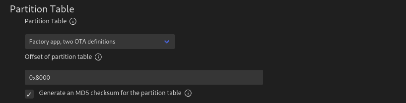
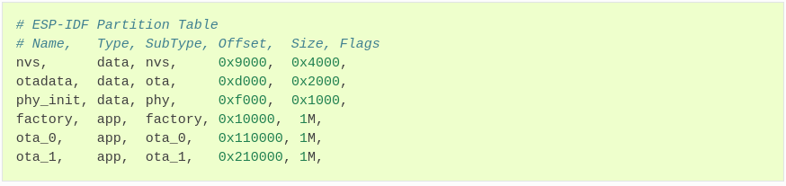
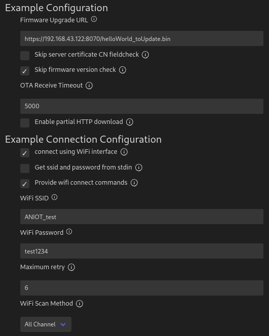
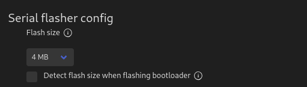

# PRÁCTICA 7 - Over The Air Updates

## Cuestiones básicas sobre el cliente OTA

<br />

>Cuestión
>
>¿Qué entradas tiene la tabla de particiones usada?


Para poder responder a la presente pregunta deberemos examinar la configuración establecida en el proyecto desde el Menú de configuración, donde deberemos fijarnos en la opción **CONFIG_PARTITION_TABLE_TYPE**, la cual especifica la tabla de particiones que utilizará el programa (más información [aquí](https://docs.espressif.com/projects/esp-idf/en/latest/esp32/api-guides/partition-tables.html)).Aunque se pueden especificar diferentes configuraciones para la tabla de particiones mediante un archivo CSV, la opción indicada únicamente nos permite seleccionar una de entre dos opciones:

- Tabla básicas con una partición Factory pero sin particiones OTA.
- Tabla básica con una partición Factory y dos particiones OTA.

En el caso del ejemplo tratado, si observamos la opción indicada en el menú de configuración podremos ver que se ha seleccionado la segunda opción, tal y como nos indica la siguiente imagen:



Teniendo esto en cuenta y si recurrimos ala documentación referente a las **Tablas de particiones** (la cual podemos ver [aquí](https://docs.espressif.com/projects/esp-idf/en/latest/esp32/api-guides/partition-tables.html)), observaremos que los diferentes campos que componen la tabla de particiones los que dispone cualquier programa con dicha opción de inicio son los siguientes:



Además de esto, para aumentar la información mostrada por la aplicación sobre las particiones y sus códigos SHA, se ha complementado la función ``get_sha256_of_partitions()`` con la impresión de los diferentes campos que componen dichas particiones y el número de particiones OTA. A continuación podemos ver un ejemplo más detallado de la salida obtenida para dicha información:

```BASH
I (662) simple_ota_example: SHA-256 for bootloader:  71b74262f8090e15c20845bb690b6c2f175f040ebb918d746beb18ec1b3045e7
I (672) simple_ota_example: Bootloader firmware fields..:
I (672) simple_ota_example: Type: 0
I (682) simple_ota_example: Address: 4096
I (682) simple_ota_example: Size: 32768

I (912) simple_ota_example: SHA-256 for current firmware:  e099cfd06efe3ce5bf7d7b96323671e40e067226cedf2570329323e82b698079
I (912) simple_ota_example: Current firmware fields..:
I (922) simple_ota_example: Label: factory
I (932) simple_ota_example: Type: 0
I (932) simple_ota_example: Subtype: 0
I (932) simple_ota_example: Address: 65536
I (942) simple_ota_example: Size: 1048576
I (942) simple_ota_example: Encrypted?: False

I (952) simple_ota_example: Número de particiones OTA..: 2
```


<br />

>Cuestión
>
>¿Cómo se llama el fichero de certificado que se incluirá en el binario?

La aplicación utiliza un fichero de certificación a la hora de realizar la conexión HTTPS con el objetivo de que esta pueda llevarse a cabo de forma segura y obtener así la nueva versión del firmware a instalar en el SoC. Sin embargo, para poder utilizarse dicho certificado, este debe ser incluido dentro de los fichero de texto que componen el componente de la aplicación que lo utiliza. De esta manera, para poder ver que certificado estas utilizado podemos examinar el fichero **CMakeList.txt** del componente main, cuyo interior contiene:

```txt
# Embed the server root certificate into the final binary
idf_build_get_property(project_dir PROJECT_DIR)
idf_component_register(SRCS "simple_ota_example.c"
                    INCLUDE_DIRS "."
                    EMBED_TXTFILES ${project_dir}/server_certs/ca_cert.pem)

```

El argumento utilizado para hacer referencia al fichero del certificado es **EMBED_TXTFILES**, el cual sirve para indicar aquellos ficheros que contienen información en cadenas de caracteres, que una vez incrustados dentro de nuestro programa, no queremos que su contenido sea modificado al realizar la compilación. Por otra parte, tal y como podemos ver en el cuadro anterior, el fichero de certificado empleado para realizar la conexión mediante HTTPS se encuentra en la dirección **server_certs/ca_cert.pem**, cuyo contenido es el siguiente:

```TXT
-----BEGIN CERTIFICATE-----
MIICrDCCAZQCCQCH33Z6fQORzTANBgkqhkiG9w0BAQsFADAYMRYwFAYDVQQDDA0x
OTIuMTY4LjguMTIwMB4XDTIyMTExOTExMTMxMloXDTIzMTExOTExMTMxMlowGDEW
MBQGA1UEAwwNMTkyLjE2OC44LjEyMDCCASIwDQYJKoZIhvcNAQEBBQADggEPADCC
AQoCggEBANnQpa7Ae64ZnHYP+fH8MSNjxWVxXgPnz2YTOUrrCIlf+6Z7cDN8lccG
VLdB4f6rFKTOzHOeeB4awt2JNt3GmThVUUQnUMv9OiiYgjLY9mqCECV6ehem09hs
H2df4m+OIDWNt697UtDibRdzNCZB+YhcbAK2L8QPLi8LW00jeBndtgRUP72ml+Aj
//edWLkSsh743DHq1h8kvoB+/a4a0vCq37cg48LaV5a0TxYPq5rn/SnIhWq/hjBF
Zbkx3sYFp5+LY4j9mH2jE8m2frvGhbOrztmZA0A0cqZtIbTXMyqjXAb3pIvA/LPB
rj/KYAK7SupJV8z6uYGQUf6qaH+l5D0CAwEAATANBgkqhkiG9w0BAQsFAAOCAQEA
ff+8fk45nUIoRglxsLftkUEwvuLo2FouOIqCZtqLqVe3VKJnf1FhLNWl/WJF4hl2
VL9JQgDyWIUXaCyQB7ZjVzcbwh8iEo9yS9VdntHZSV0/AaYqAZX9MXFyZ4zk/4bS
I5d6IbJy2mQhaH/GRAg3flEqXHa+kQFYe7tcTmTy1QQ7iYhX2GhO5gba/X0p7qFx
yTY/owggA+FvUIBKpMRErgDKt2tYb2fCWae0bWaKY+qzWBpUTyRLCNzehNp/uHxn
irxDALfzRIYrtDhTrrcMP6nXMO8ywnogk6jJIe0S7piy1iLqlEjNiNw3QF9o0KdX
47COkPGwZLGjiGPLZbQArw==
-----END CERTIFICATE-----
```


<br />

>Cuestión
>
>¿Cómo y dónde se indica que se debe incluir el certificado?

Para responder a la pregunta vamos a examinar la estructura de configuración utilizada a la hora de llevar a cabo la conexión HTTPS con el servidor que nos proveerá de la nueva imagen del firmware. En el siguiente cuadro podemos ver la formación de dicha estructura y como se especifica el uso de un certificado mediante la línea `.cert_pem = (char *)server_cert_pem_start, `, lo cual hace obligatorio el uso de uno a la hora de realizar la conexión con el servidor.

```C
esp_http_client_config_t config = {
    .url = CONFIG_EXAMPLE_FIRMWARE_UPGRADE_URL,
#ifdef CONFIG_EXAMPLE_USE_CERT_BUNDLE
    .crt_bundle_attach = esp_crt_bundle_attach,
#else
    .cert_pem = (char *)server_cert_pem_start,
#endif
    .event_handler = _http_event_handler,
    .keep_alive_enable = true,
#ifdef CONFIG_EXAMPLE_FIRMWARE_UPGRADE_BIND_IF
    .if_name = &ifr,
#endif
};
```

Posteriormente, en la última parte de la ejecución, podemos ver como se lleva a cabo la conexión con el servidor utilizando la estructura de configuración antes mencionada, para la cual será necesario dicho certificado.

```C
esp_https_ota_config_t ota_config = {
    .http_config = &config,
};
ESP_LOGI(TAG, "Attempting to download update from %s", config.url);
esp_err_t ret = esp_https_ota(&ota_config);
if (ret == ESP_OK) {
    ESP_LOGI(TAG, "OTA Succeed, Rebooting...");
    esp_restart();
} else {
    ESP_LOGE(TAG, "Firmware upgrade failed");
}
```


<br />

>Cuestión
>
>¿Qué es el símbolo server_cert_pem_start?

La variable `server_cert_pem_start` es utilizado en la estructura de configuración para la conexión mediante HTTPS para especificar el archivo donde se encuentra el certificado a emplear en la comunicación. Además de esto, dicha variable también se utiliza anteriormente en el código, concretamente en la línea donde se declara y a la cual se le asigna un valor a priori extraño. En el siguiente cuadro podemos ver dicha asignación e investigaremos para averiguar que se esta haciendo realmente.

```C
extern const uint8_t server_cert_pem_start[] asm("_binary_ca_cert_pem_start");
extern const uint8_t server_cert_pem_end[] asm("_binary_ca_cert_pem_end");
```

Para responder a esta pregunta debemos saber que los ficheros externos que queremos que sean incrustados en la aplicación pero que no deseamos que sean modificados a la hora de realizar la compilación deben ser especificados mediante las variables **EMBED_FILES** o **EMBED_TXTFILES** mediante el fichero **CMakeList.xt** (de manera similar a lo visto en la segunda cuestión).

El contenido de los ficheros especificados de la forma indicada será incluido en la sección **.roadata** de la memoria flash, siendo accesibles a través de unos símbolos concretos, los cuales son formados a través de los nombres de dichos archivos, sustituyendo los caracteres especiales por como "\", "." o "," por "_" e incluyendo siempre el prefijo "_binary". Además de esto, mediante los sufijos "_start" y "_end" acceder al comienzo y al final de dicha variable.

De esta manera, si queremos poder utilizar nuestro certificado, deberemos utilizar la referencia que apunta inicio de su contenido una vez ha sido incrustado en la aplicación. En nuestro caso, si el fichero es **ca_cert.pem**, el símbolo que necesitaremos utilizar será **_binary_ca_cert_pem_start**, el cual es el mismo que asignamos a la variable **server_cert_pem_start**, utilizada para especificar el certificado empleado en la conexión HTTPS.

El único elemento que aún no hemos explicado es el operador **asm**, cuya función se basa en ensamblar dentro del primer argumento el contenido referenciado en memoria flash por el símbolo indicado como segundo argumento. Para ver más información sobre la incrustación de archivos binarios en la aplicación, se puede acceder al siguiente [enlace](https://docs.espressif.com/projects/esp-idf/en/latest/esp32/api-guides/build-system.html#embedding-binary-data).

En conclusión, una vez visto lo anterior podemos decir que la variable **server_cert_pem_start** contiene el contenido del certificado utilizado en la conexión HTTPS sin que este haya sido o sea modificado durante la compilación.


<br />

## Tareas básicas con cliente y el servidor OTA


<br />

>Tarea
>
>Hacer funcionar el ejemplo conectando a un servidor que estará ejecutando en el equipo del profesor. Se usará este certificado para la conexión segura por HTTP y la red WiFi creada en el laboratorio. Se proporcionarán los credenciales de la WiFi y la IP del servidor durante el laboratorio.

**El presente ejercicio no pudo llevarse a cabo debido a la imposibilidad de disponer en el aula de los recursos necesarios para el mismo.**


<br />

>Tarea
>
>Alterar un byte del fichero del certificado y probar nuevamente.

**El presente ejercicio no pudo llevarse a cabo debido a la imposibilidad de disponer en el aula de los recursos necesarios para el mismo.** 


<br />

>Tarea
>
>[Seguir los pasos del ejemplo](https://github.com/espressif/esp-idf/tree/master/examples/system/ota) para crear vuestro propio servidor HTTPS y certificado y probad de nuevo.

Con el objetivo de facilitar la compresión de la realización del ejercicio vamos a dividir el mismo en pasos. Para la realización del presente proyecto necesitaremos poner en contacto tres elementos completamente diferenciados:
- Un nuevo firmware que será el que se descargue e instale en el SoC.
- Un servidor utilizado des que descargar el firmware mediante SSL.
- Un cliente instalado en el SoC que descargue e instale el nuevo firmware.


<br />

### Paso 1 - Creación del nuevo firmware

El primer paso será la creación del nuevo firmware que se descargará desde el servidor e instalará en el SoC. Lo habitual sería desarrollar una nueva versión de la aplicación que se encuentra corriendo actualmente, pero para facilitar la compresión vamos a crear un nuevo proyecto que sea lo suficientemente simple y visual como para diferenciarlo cuando este se comience a ejecutar.

En nuestro caso llamaremos al proyecto **ej2_helloWorld_toUpdate** y en el siguiente cuadro podremos ver el contenido de su función principal:

```C
#include <stdio.h>
#include "esp_log.h"


const char * TAG = "MAIN";

void app_main(void){

    ESP_LOGI(TAG,"THIS IS A NEW FIRMWARE VERSION -> HELLO WORLD :)\n");
}
```

Como podemos ver, el código es extremadamente simple, pero necesitaremos el proyecto compilado en un binario. Este archivo será el resultante de llevar a cabo la compilación estándar del proyecto y se situará dentro de la carpeta `buil/` una vez que dicho proceso haya terminado. Además para que la compilación de como resultado el binario con el nombre deseado, necesitaremos indicarlo en la instrucción **project**, dentro del archivo **CMakeList.txt** general del proyecto, tal y como podemos ver en el siguiente cuadro:

```C
cmake_minimum_required(VERSION 3.16)

include($ENV{IDF_PATH}/tools/cmake/project.cmake)
project(helloWorld_toUpdate)
```


<br />

### Paso 2 - Configurador del servidor

El servidor encargado de provisionar el nuevo firmware a instalar en el SoC estará corriendo dentro de un equipo de sobremesa, el cual utilizará el protocolo de conexión segura **SSL** para llevar a cabo la comunicación con los clientes y la correspondiente descarga. Para poder hacer esto, el primer paso será generar un certificado de seguridad que podamos utilizar para llevar a cabo la conexión.

La generación del certificado la llevaremos a cabo mediante la herramienta **OpenSSL**, en línea de comandos. Aunque dicha herramienta solicita diversos datos al para llevar a cabo la creación dle certificado, el único que afectará a nuestro uso del mismo es el campo **Common Name**, en el cual necesitaremos indicar la dirección IP del equipo donde se encontrará nuestro servidor (en nuestro caso se tratará de la dirección **192.168.43.122**). En el siguiente cuadro podremos ver la generación del certificado:

```BASH
mario@debian12:~/server_OTA/build$ openssl req -x509 -newkey rsa:2048 -keyout ca_key.pem -out ca_cert.pem -days 365 -nodes
......+............+.+++++++++++++++++++++++++++++++++++++++++++++++++++++++++++++++++*............+.....+............+.......+...+........+...+.+...+...........+......+.+..+.+.....+.+........+...+...+......+++++++++++++++++++++++++++++++++++++++++++++++++++++++++++++++++*...........+++++++++++++++++++++++++++++++++++++++++++++++++++++++++++++++++
.+......+...+......+.+..+.+++++++++++++++++++++++++++++++++++++++++++++++++++++++++++++++++*......+...........+++++++++++++++++++++++++++++++++++++++++++++++++++++++++++++++++*.........+...+++++++++++++++++++++++++++++++++++++++++++++++++++++++++++++++++
-----
You are about to be asked to enter information that will be incorporated
into your certificate request.
What you are about to enter is what is called a Distinguished Name or a DN.
There are quite a few fields but you can leave some blank
For some fields there will be a default value,
If you enter '.', the field will be left blank.
-----
Country Name (2 letter code) [AU]:ES
State or Province Name (full name) [Some-State]:Madrid
Locality Name (eg, city) []:Madrid
Organization Name (eg, company) [Internet Widgits Pty Ltd]:UCM
Organizational Unit Name (eg, section) []:es
Common Name (e.g. server FQDN or YOUR name) []:192.168.43.122
Email Address []:marioa25@ucm.es
```

Un vez hemos creado tanto el certificado como el archivo binario que contiene el nuevo firmware, deberemos crear una nueva carpeta que servirá como localización para los archivos de nuestro servidor y constituirá el directorio raíz del mismo. En nuestro caso llamaremos a la carpeta **ej2_serverSSL_content** y en cuyo interior depositaremos tanto el archivo binario como los archivos generados mediante **OpenSSL** al crear el certificado:

```BASH
mario@debian12:~/server_OTA/build$ mv ca_cert.pem ej2_serverSSL_content/
mario@debian12:~/server_OTA/build$ mv ca_key.pem ej2_serverSSL_content/
mario@debian12:~/server_OTA/build$ mv helloWorld_toUpdate ej2_serverSSL_content/
```

Una vez tenemos los tres archivos dentro del directorio de nuestro servidor, únicamente necesitaremos lanzarlo mediante la orden utilizada en el siguiente cuadro, donde también podremos ver la respuesta afirmativa de la creación del mismo y como este queda a la espera de las solicitudes de los clientes:

```BASH
mario@debian12:~/serverPrueba$ openssl s_server -WWW -key ca_key.pem -cert ca_cert.pem -port 8070
Using default temp DH parameters
ACCEPT
```


<br />

### Paso 3 - Configurador del cliente

Como último paso necesitaremos configurar el programa cliente, el cuál será el encargado de ejecutarse en el SoC, conectarse al servidor descargando el nuevo firmware e instalarlo. Para esto utilizaremos el proyecto de ejemplo **advanced_https_ota_example**, u cuyo primer paro será llevar a cabo la configuración dle mismo mediante el menú de configuración. Dentro de este necesitaremos especificar cual será el SSID y la contraseña del Punto de Acceso al que se conecte el SoC, mediante el cual se llevará a cabo la comunicación con el servidor. 

También necesitaremos especificar la ruta donde se encuentra el nuevo firmware que queremos descargar, partiendo desde el directorio raíz donde se esta ejecutando el servidor y el cual dependerá de donde hayamos puesto el binario dentro del mismo. En la siguiente imagen podemos ver dicha configuración:



Antes de poder ejecutar el cliente necesitaremos aportar al mismo el certificado con el que se comunicará con el servidor, el cual se trata del archivo **ca_cert.pem** generado anteriormente. Este deberá ser pegado dentro de la carpeta **server_certs/**. En este punto estaremos listos para ejecutar el cliente dentro del SoC, el cual llevará a cabo los siguientes pasos:

1) Iniciará la conexión al Punto de Acceso indicado mediante el SSID y la contraseña indicadas como parámetro.
2) Obtendrá las direcciones IP desde el Punto de Acceso.
3) Iniciará la comunicación con el servidor mediante la dirección IP dentro de la URL indicada como parámetro.
4) Se enviará el certificado al servidor 
5) Se descargará el nuevo firmware en el SoC indicado mediante el parámetro URL.
6) Se comprobará el correcto funcionamiento del certificado.
7) Se instalará el nuevo firmware en la próxima partición OTA utilizada.
8) Se reiniciará el SoC utilizando como sección de arranque la partición OTA del nuevo firmware.

**IMPORTANTE:** Puede darse el caso de que el proceso se ejecute correctamente pero que este quede parado debido que no se cierra la conexión TCP entre el cliente y el servidor. En dicho caso, será necesario cerrarla de forma manual.

En el siguiente cuadro tenemos um ejemplo de la ejecución del programa cliente, donde podemos ver toda la configuración inicial y el proceso previo a la descarga indicado anteriormente. Finalmente podemos ver como el SoC se reinicio y comienza a ejecutar el nuevo firmware descargado, correspondiente al proyecto **ej3_helloWorld_toUpdate**.

```BASH
I (611) main_task: Calling app_main()
I (611) advanced_https_ota_example: OTA example app_main start
I (651) example_connect: Start example_connect.
I (661) wifi:wifi driver task: 3ffbfbcc, prio:23, stack:6656, core=0
I (671) wifi:wifi firmware version: ce9244d
I (671) wifi:wifi certification version: v7.0
I (671) wifi:config NVS flash: enabled
I (671) wifi:config nano formating: disabled
I (681) wifi:Init data frame dynamic rx buffer num: 32
I (681) wifi:Init management frame dynamic rx buffer num: 32
I (691) wifi:Init management short buffer num: 32
I (691) wifi:Init dynamic tx buffer num: 32
I (701) wifi:Init static rx buffer size: 1600
I (701) wifi:Init static rx buffer num: 10
I (701) wifi:Init dynamic rx buffer num: 32
I (711) wifi_init: rx ba win: 6
I (711) wifi_init: tcpip mbox: 32
I (721) wifi_init: udp mbox: 6
I (721) wifi_init: tcp mbox: 6
I (721) wifi_init: tcp tx win: 5744
I (731) wifi_init: tcp rx win: 5744
I (731) wifi_init: tcp mss: 1440
I (741) wifi_init: WiFi IRAM OP enabled
I (741) wifi_init: WiFi RX IRAM OP enabled
I (751) phy_init: phy_version 4670,719f9f6,Feb 18 2021,17:07:07
I (851) wifi:mode : sta (24:0a:c4:ea:36:b4)
I (851) wifi:enable tsf
I (861) example_connect: Connecting to ANIOT_test...
I (861) example_connect: Waiting for IP(s)
I (3271) wifi:new:<13,0>, old:<1,0>, ap:<255,255>, sta:<13,0>, prof:1
I (4421) wifi:state: init -> auth (b0)
I (4441) wifi:state: auth -> init (1c0)
I (4441) wifi:new:<13,0>, old:<13,0>, ap:<255,255>, sta:<13,0>, prof:1
I (4441) example_connect: Wi-Fi disconnected, trying to reconnect...
I (6861) example_connect: Wi-Fi disconnected, trying to reconnect...
I (9271) wifi:new:<13,0>, old:<13,0>, ap:<255,255>, sta:<13,0>, prof:1
I (9281) wifi:state: init -> auth (b0)
I (9281) wifi:state: auth -> assoc (0)
I (9291) wifi:state: assoc -> run (10)
I (9311) wifi:connected with ANIOT_test, aid = 19, channel 13, BW20, bssid = 5a:25:a7:40:ea:14
I (9321) wifi:security: WPA2-PSK, phy: bgn, rssi: -49
I (9321) wifi:pm start, type: 1

I (9351) wifi:<ba-add>idx:0 (ifx:0, 5a:25:a7:40:ea:14), tid:0, ssn:0, winSize:64
I (9371) wifi:APs beacon interval = 102400 us, DTIM period = 2
I (10321) esp_netif_handlers: example_netif_sta ip: 192.168.43.198, mask: 255.255.255.0, gw: 192.168.43.1
I (10321) example_connect: Got IPv4 event: Interface "example_netif_sta" address: 192.168.43.198
I (10651) example_connect: Got IPv6 event: Interface "example_netif_sta" address: fe80:0000:0000:0000:260a:c4ff:feea:36b4, type: ESP_IP6_ADDR_IS_LINK_LOCAL
I (10651) example_common: Connected to example_netif_sta
I (10661) example_common: - IPv4 address: 192.168.43.198,
I (10661) example_common: - IPv6 address: fe80:0000:0000:0000:260a:c4ff:feea:36b4, type: ESP_IP6_ADDR_IS_LINK_LOCAL
I (10671) wifi:Set ps type: 0, coexist: 0

I (10681) advanced_https_ota_example: Starting Advanced OTA example
I (10691) advanced_https_ota_example: OTA started
I (10691) main_task: Returned from app_main()
I (11751) esp_https_ota: Starting OTA...
I (11751) advanced_https_ota_example: Connected to server
I (11751) esp_https_ota: Writing to partition subtype 16 at offset 0x110000
I (11751) advanced_https_ota_example: Reading Image Description
I (11751) advanced_https_ota_example: Running firmware version: 31c2e7f-dirty
I (11771) advanced_https_ota_example: Verifying chip id of new image: 0
I (212081) esp_image: segment 0: paddr=00110020 vaddr=3f400020 size=09260h ( 37472) map
I (212091) esp_image: segment 1: paddr=00119288 vaddr=3ffb0000 size=020f0h (  8432) 
I (212101) esp_image: segment 2: paddr=0011b380 vaddr=40080000 size=04c98h ( 19608) 
I (212111) esp_image: segment 3: paddr=00120020 vaddr=400d0020 size=13950h ( 80208) map
I (212131) esp_image: segment 4: paddr=00133978 vaddr=40084c98 size=07380h ( 29568) 
I (212151) esp_image: segment 0: paddr=00110020 vaddr=3f400020 size=09260h ( 37472) map
I (212161) esp_image: segment 1: paddr=00119288 vaddr=3ffb0000 size=020f0h (  8432) 
I (212171) esp_image: segment 2: paddr=0011b380 vaddr=40080000 size=04c98h ( 19608) 
I (212181) esp_image: segment 3: paddr=00120020 vaddr=400d0020 size=13950h ( 80208) map
I (212201) esp_image: segment 4: paddr=00133978 vaddr=40084c98 size=07380h ( 29568) 
I (212281) advanced_https_ota_example: Boot partition updated. Next Partition: 16
I (212281) advanced_https_ota_example: OTA finish
I (212281) advanced_https_ota_example: ESP_HTTPS_OTA upgrade successful. Rebooting ...
I (213291) wifi:state: run -> init (0)
I (213291) wifi:pm stop, total sleep time: 932835 us / 203966198 us
.
.
.
I (331) main_task: Started on CPU0
I (341) main_task: Calling app_main()
I (351) MAIN: THIS IS A NEW FIRMWARE VERSION -> HELLO WORLD :)
```


<br />

## Tareas avanzadas con cliente y servidor OTA

>Tareas
>
>La aplicación inicial corresponderá con una aplicación similar a la de prácticas anteriores: una lectura periódica del sensor de temperatura. Se añadirá la siguiente funcionalidad:
>- Cuando se reciba un evento externo (la pulsación de un botón o la lectura del sensor de infrarrojos de una distancia menor que un umbral), la aplicación se conectará al servidor HTTPS predefinido y se bajará la nueva imagen (si se usa MQTT, la URL del servidor y el nombre de la nueva imagen se pueden comunicar en el mensaje; pero el certificado debería estar preinstalado).
>- Se desarrollará una función de auto-diagnóstico (self-test) que permita decidir si la nueva imagen se comporta de forma correcta.
>- Se utilizará la opción de rollback para indicar si la nueva imagen se elige para futuros arranques o se marca como inválida.

Para llevar a cabo el presente ejercicio vamos a utilizar como base el ejercicio empleado en la sección anterior, el cual integraremos como un nuevo componente del ya conocido proyecto de integración. Para evitar repeticiones vamos a obviar aquellos pasos ya descritos anteriormente y que hacen referencia al proceso de configuración y comunicación entre el cliente y el servidor.

El primer paso será la creación de un medio por el que podamos indicarle a al SoC cundo se debe actualizar. Esto lo llevaremos cabo mediante un pin GPIO, para lo cual necesitaremos modificar el componente **monitorGPIO** ya implementado anteriormente. En el siguiente cuadro podemos ver dicha configuración:

```C
esp_event_loop_handle_t monitor_gpio_init(){
.
.
.
    // Initialize OTA GPIO Port
    gpio_reset_pin(OTA_BUTTON_GPIO_PORT);
    gpio_set_direction(OTA_BUTTON_GPIO_PORT, GPIO_MODE_INPUT);
    gpio_set_pull_mode(OTA_BUTTON_GPIO_PORT, GPIO_PULLUP_PULLDOWN);
.
.
.
}

static void gpio_timer_callback(void *arg)
{
.
.
.

    if (gpio_get_level(OTA_BUTTON_GPIO_PORT)){
        ESP_LOGI(TAG, "Botón GPIO %d presionado", OTA_BUTTON_GPIO_PORT);
        esp_event_post_to(loop_gpio, MONITOR_GPIO, MONITOR_OTA_GPIO_BUTTON_PRESSED, NULL, 0, portMAX_DELAY);
    }
.
.
.
}
```

Para poder integrar el nuevo componente, necesitaremos incluir el componente externo **protocol_examples_common**, tanto en el fichero de **CMkeLists.txt** del propio componente como en el general del proyecto. En el siguiente cuadro podemos ver la línea a incluir:

```C
set(EXTRA_COMPONENT_DIRS $ENV{IDF_PATH}/examples/common_components/protocol_examples_common)
```

En lo referente al nuevo componente integrado, el primer paso será habilitar el soporte de Rollback dentro de menú de configuración y la red WIFI a la cual vamos a conectarnos (nosotros utilizaremos la misma que en el ejercicio anterior). En la siguiente imagen podemos ver la opción de configuración indicada:




Necesitaremos crear una función de self-check, la cual se encargara de "verificar" que el nuevo firmware encargado se encuentra en el estado correcto. Para esto se ha creado una nueva función que únicamente retorna un estado ESP_OK o un ESP_FAIL con un 50% de posibilidades.

```C
esp_err_t self_test(void){

    srand(time(0));
    if((rand() & 1)? true : false){
        return ESP_OK;
    }else{
        return ESP_FAIL;
    }
}
```

Para poder operar con esta función y llevar a cabo el proceso de rollback de forma correcta, el ejemplo utilizado ya tiene definida la sección adecuada para ello, donde nosotros únicamente necesitamos especificar dicha función. Esta se encuentra al final de la función `void advanced_ota_example_task(void *pvParameter)` y para poder acceder a ella necesitamos haber configurado la opción indicada anteriormente. En el siguiente cuadro podemos ver la configuración de dicha sección:


```C
//Comprobción de la función self_check y ejecución del rollback
#if defined(CONFIG_BOOTLOADER_APP_ROLLBACK_ENABLE)
    /**
     * We are treating successful WiFi connection as a checkpoint to cancel rollback
     * process and mark newly updated firmware image as active. For production cases,
     * please tune the checkpoint behavior per end application requirement.
     */
    ESP_LOGI(TAG, "Comprobando integridad del nuevo firmware");
    const esp_partition_t *running = esp_ota_get_running_partition();
    esp_ota_img_states_t ota_state;
    if (esp_ota_get_state_partition(running, &ota_state) == ESP_OK) {
        if (ota_state == ESP_OTA_IMG_PENDING_VERIFY) {

                esp_err_t checkStatus = self_test();
            if (checkStatus == ESP_OK) {       //esp_ota_mark_app_valid_cancel_rollback() == ESP_OK
                ESP_LOGI(TAG, "La aplicación es válida. Continuando con el proceso de actualización");
                esp_ota_mark_app_valid_cancel_rollback();
            } else {
                ESP_LOGE(TAG, "La aplicación es errónea. Procediendo al Rollback.");
                esp_ota_mark_app_invalid_rollback_and_reboot();
            }

        }
    }
```

En este paso ya podremos volver a ejecutar nuestro proyecto de estructuración y una vez se haya pulsado el botón GPIO conectado al pin correspondiente, el sistema comenzará el proceso OTA de actualización. En nuestro caso hemos creado una nueva versión del proyecto que únicamente cambia el encabezado de la mismo, pero también se puede utilizar el binario del proyecto **ej2_helloWorld_toUpdte**, igul que en el ejercicio anterior. En el siguiente cuadro tenemos un ejemplo de ejecución, donde se han recortados ciertas partes de la salida para evitar que sea difícil de entender:

```BASH
I (680) main_task: Calling app_main()
I (680) MAIN: Comenzando ejecución.


I (680) MAIN: ******************************
I (690) MAIN: *BIENVENIDOS A LA VERSIÓN 1.0*
I (690) MAIN: ******************************


I (700) MAIN: Motivo del reinicio (0): ESP_SLEEP_WAKEUP_UNDEFINED.
I (700) MAIN: Comenzando el proceso de inicialización.
I (740) pm: Frequency switching config: CPU_MAX: 240, APB_MAX: 240, APB_MIN: 10, Light sleep: ENABLED
I (740) MAIN: El Power Manager ha sido configurado adecuadamente.
I (750) MAIN: El timer de acceso al modo Deep Sleep ha sido configurado adecuadamente.
I (760) MOCK_WIFI: Wifi Initialized
I (5770) MOCK_WIFI: Wifi Connected
I (5770) MAIN: WIFI CONNECTED
I (5770) BUFFER: Buffer correctamente inicializado.
I (5770) gpio: GPIO[25]| InputEn: 0| OutputEn: 0| OpenDrain: 0| Pullup: 1| Pulldown: 0| Intr:0 
I (5780) gpio: GPIO[32]| InputEn: 0| OutputEn: 0| OpenDrain: 0| Pullup: 1| Pulldown: 0| Intr:0 
I (5790) MONITOR-GPIO: GPIO Initialized
I (5800) OTA_service: Servicio OTA Inicializado con éxito
I (5800) MAIN: Proceso de inicialización finalizado con éxito.

I (7860) MAIN: Temperatura: 24.740026
I (7860) BUFFER: Dato correctamente almacenado
I (7960) MAIN: Humedad: 35.652679
I (7960) BUFFER: Dato correctamente almacenado
I (8770) MOCK_WIFI: Wifi got IP
I (8770) MAIN: WIFI GOT IP
I (9860) MAIN: Temperatura: 24.707851
I (9860) BUFFER: Dato leído correctamente.
I (11960) MAIN: Humedad: 35.645050
I (11960) MOCK_WIFI: Data '35.645050' sent successfully
I (12770) MONITOR-GPIO: Botón GPIO 32 presionado
W (12770) MAIN: Botón pulsado, comenzando OTA
.
.
.
I (17820) OTA_service: Starting Advanced OTA example
I (17830) OTA_service: OTA started
I (18550) OTA_service: Connected to server
I (18550) esp_https_ota: Starting OTA...
I (18550) esp_https_ota: Writing to partition subtype 16 at offset 0x110000
I (18550) OTA_service: Reading Image Description
I (18560) OTA_service: Running firmware version: 8c2ae0a-dirty
I (18560) OTA_service: Verifying chip id of new image: 0
I (28090) esp_image: segment 0: paddr=00110020 vaddr=3f400020 size=09198h ( 37272) map
I (28100) esp_image: segment 1: paddr=001191c0 vaddr=3ffb0000 size=020f0h (  8432) 
I (28110) esp_image: segment 2: paddr=0011b2b8 vaddr=40080000 size=04d60h ( 19808) 
I (28120) esp_image: segment 3: paddr=00120020 vaddr=400d0020 size=13818h ( 79896) map
I (28140) esp_image: segment 4: paddr=00133840 vaddr=40084d60 size=07284h ( 29316) 
I (28160) esp_image: segment 0: paddr=00110020 vaddr=3f400020 size=09198h ( 37272) map
I (28170) esp_image: segment 1: paddr=001191c0 vaddr=3ffb0000 size=020f0h (  8432) 
I (28170) esp_image: segment 2: paddr=0011b2b8 vaddr=40080000 size=04d60h ( 19808) 
I (28180) esp_image: segment 3: paddr=00120020 vaddr=400d0020 size=13818h ( 79896) map
I (28200) esp_image: segment 4: paddr=00133840 vaddr=40084d60 size=07284h ( 29316) 
I (28270) OTA_service: Boot partition updated. Next Partition: 16
I (28270) OTA_service: OTA finish
I (28270) OTA_service: ESP_HTTPS_OTA upgrade successful. Rebooting ...
I (29270) wifi:state: run -> init (0)
I (29270) wifi:pm stop, total sleep time: 918048 us / 12875232 us

I (29270) wifi:<ba-del>idx:0, tid:0
I (29270) wifi:new:<10,0>, old:<10,0>, ap:<255,255>, sta:<10,0>, prof:1
E (29280) wifi:NAN WiFi stop
I (29340) wifi:flush txq
I (29340) wifi:stop sw txq
I (29340) wifi:lmac stop hw txq
I (29340) wifi:Deinit lldesc rx mblock:10
ets Jun  8 2016 00:22:57
.
.
.

I (386) main_task: Calling app_main()
I (680) MAIN: Comenzando ejecución.


I (680) MAIN: ******************************
I (690) MAIN: *BIENVENIDOS A LA VERSIÓN 2.0*
I (690) MAIN: ******************************
.
.
.
```